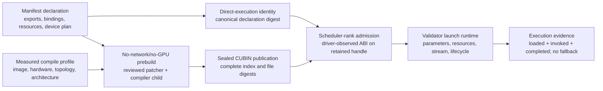

# Sealed direct artifacts

Optima can execute a contribution as a sealed CUDA artifact without retaining a
miner-supplied Python launcher in the engine. The manifest describes a closed
launch program; a validator-owned builder compiles it to CUBIN in an isolated
prebuild; and validator-owned runtime code admits, materializes, and launches the
artifact.

This path does not enlarge the slot boundary. The validator still owns semantic
inputs and outputs, allocation, streams, specialization selection, correctness,
graph evidence, qualification, and release admission.

## Registered provider

The provider registry is an immutable validator table. It has no manifest or
plugin registration API. The registered table contains one provider:

| Property | Registered value |
|---|---|
| Provider ID | `cutlass.cute.cubin.v1` |
| Artifact kind | `cuda_cubin` |
| Binding ABI | `cuda_driver_params.v1` |
| Build phase | `oci_prebuild_only` |
| Load phase | `isolated_engine_worker_only` |
| Reviewed patcher | `optima.build-cute-cubin.v1` |
| Rebuild feature | `rebuild:build_cute_cubin` |
| Publication directory | `cute_cubin` |
| Qualification status | authoritative and crownable |

A target must admit both `aot:cutlass.cute.cubin.v1` and
`rebuild:build_cute_cubin`. An unknown provider, an unregistered build feature,
or a provider that is not both authoritative and crownable is rejected before
evaluation or release materialization. The complete provider-registry snapshot
and digest are part of the target-catalog identity.

The provider ID selects data-only policy. It does not select a compiler callback,
loader callback, host launcher, or candidate-defined ABI. Those implementations
remain reviewed Optima code.

## Contract layers



Each layer is independently reopened. Matching source bytes are insufficient if
the provider policy, compile profile, device plan, native publication, observed
ABI, or runtime evidence differs.

## Manifest execution model

An operation uses `[[ops.aot_exports]]` to declare one or more ordered artifact
steps. Each export requires:

- `provider`, `name`, and the compiler-side `factory` symbol;
- `profile_inputs`, selected from the provider's bounded allowlist;
- ordered semantic `bindings`; and
- a complete `device_plan` for the device provider.

Optional `role`, `plan`, `step`, `specializes`, and `prelaunch` fields define a
bounded lifecycle and specialization program. `provider_capability_requirements`
and `specialization_capability_requirements` are validator-derived when a
manifest is parsed and must reproduce exactly when sealed state is reopened.

`factory` names Python executed only in the disposable compiler child. It is not
an engine entry point. The compatibility `ops.entry` field remains syntactically required
by the bundle ABI, but direct-artifact execution does not call it and canonicalizes
the runtime entry to `_optima_direct_artifact`.

Plan variants use exact-equality specialization predicates. Overlap is accepted
only when it forms a strict fallback chain. Runtime chooses the unique
most-specific matching plan; an ambiguous or missing required direct binding is
an error rather than a request to execute candidate host code.

See [Bundle manifest](../reference/manifest-schema.md) for the field-level schema.

## Compile profile and architecture

CuTe compilation can require hardware facts even though prebuild has no GPU. A
trusted arena measures those facts first and writes a canonical
`optima.native-cute-compile-profile.v1` document. The profile binds:

- logical architecture, such as `sm103`;
- compiler architecture, such as `sm_103a`;
- image, platform, worker-distribution, logical-hardware, device-policy, and
  topology digests;
- visible GPU count and TP, EP, and DP degrees;
- bounded provider constants and their measurement digest; and
- the provider and schema.

Logical and compiler architectures must name the same architecture family. The
profile is mounted read-only into prebuild and is checked again against the launch.
It is data only: it imports neither CUDA nor candidate code.

The registered provider permits only these profile inputs:

```text
max_active_clusters.cluster_size_1
max_active_clusters.cluster_size_2
max_active_clusters.cluster_size_4
max_active_clusters.cluster_size_8
max_active_clusters.cluster_size_16
```

An export selects the only profile values its factory can receive. Candidate code cannot
probe the device or request a constant outside that declaration; the parser does not
attempt to prove that factory code uses every selected value. A CUBIN compiled under one profile
is not portable authority for a launch with a different logical architecture,
image, topology, device policy, or profile digest.

## Hermetic prebuild

Native compilation happens before an engine arm starts. The controller launches a
disposable OCI container with:

- a digest-pinned image and platform with `--pull=never`;
- `--network=none`, no GPU visibility, and no model, wallet, home, Docker socket,
  or ambient host mount;
- a read-only root and engine-tree mount;
- a read-only compile-profile mount and one lease-scoped output mount;
- all Linux capabilities dropped, `no-new-privileges`, reviewed seccomp, a
  non-root UID/GID, and CPU, memory, PID, tmpfs, time, inode, and output quotas;
- `CUDA_VISIBLE_DEVICES=""` and `NVIDIA_VISIBLE_DEVICES=void`.

The outer worker parses candidate files as data and invokes only the registered
rebuild patcher. The patcher starts a compiler child, imports the validator's CuTe
compiler and options before importing the candidate module, and calls the declared
factory with a bounded profile context. The factory must return the exact
validator-defined compile-request type. The validator forces the no-JIT-engine
mode and its compile options, including CUBIN retention.

The authoritative output is CUBIN only. Generated host objects, Python launchers,
PTX fallbacks, and JIT engines are not published. The host never imports candidate
Python and never loads the produced native object.

## Sealed publication

The prebuild writes a bounded canonical index plus the exact CUBIN files. A
GPU-free reopen verifies the directory inventory, file paths, sizes, SHA-256
digests, and CUDA ELF header without importing the CUDA driver. The index binds:

- provider and binding ABI;
- engine-tree, native-build-spec, compile-profile, and patcher digests;
- logical and compiler architecture;
- installed CuTe/CUTLASS distribution identities and forced compile options;
- export, target-authority, resource-plan, binding, specialization, prelaunch,
  and device-plan declarations; and
- every CUBIN's bytes and complete logical kernel contract.

The runtime mount is read-only. A scheduler rank can reopen and load the
publication but cannot compile a missing artifact or repair a mismatched index.

## Complete device ABI

`device_plan` uses schema `optima.device-launch-plan.v1`. It contains two closed
inventories:

1. `kernels`: sorted, unique logical kernel names and the exact byte width of every
   formal parameter;
2. `launches`: a contiguous ordinal sequence naming a logical kernel, grid, block,
   optional cluster, dynamic shared-memory expression, ordered parameters, stream
   binding, and allowlisted launch attributes.

The plan schema admits at most 1,024 logical kernels, 256 launches, and 64
semantic bindings. Dynamic shared memory is an expression over live call data;
after evaluating it for an invocation, the runtime rejects values above 1 MiB.
A launch's parameter widths must equal its logical kernel contract exactly.

CuTe-generated physical symbol names depend on the materialized module name, so
they are not a stable miner-facing identifier. After the scheduler rank has
completed CUDA device setup, the loader opens the exact CUBIN, observes its full
physical kernel inventory through the CUDA Driver API, and compares the complete
per-ordinal parameter-width vectors. Canonical logical ordinal is then bound to
physical ordinal. The admitted library handle is retained for launch; Optima does
not inspect, unload, and reopen a second object.

Admission computes the CUBIN digest and size plus driver-observed ABI and contract
digests. The driver walk observes physical names and parameter offsets/sizes to
derive that ABI digest, but the retained load receipt stores the digests rather
than the complete raw physical inventory. Logical-to-physical selection remains
ordinal.

## Validator-owned materialization

The device plan is a data program. At each invocation Optima constructs the CUDA
parameter frame from the live slot call. Its closed parameter primitives are:

| Primitive | Validator action |
|---|---|
| `pointer` | Projects a device pointer from an admitted semantic binding |
| `scalar` | Evaluates a checked expression and packs an exact scalar type |
| `packed_struct` | Zeroes the ABI frame, then writes declared scalar, pointer, or bounded static fields at checked offsets |
| `tma_descriptor` | Encodes a versioned 128-byte tensor map from an admitted tensor and checked dimension expressions |
| `cutlass_fast_divmod_i32_v1` | Constructs the fixed 12-byte CUTLASS FastDivmod representation |
| `cute_fast_divmod_i32_v1` | Constructs the fixed 12-byte CuTe FastDivmod representation |
| `group_handle` | Projects a provider-authorized native handle or peer-pointer table |

Checked expressions can use bounded arithmetic over live tensor dimensions,
strides, element counts, and admitted scalars. Candidate pointer construction,
arbitrary integer addresses, callbacks, host objects, implicit Python
conversions, and unregistered expression operations are absent. Grid, block,
optional cluster, shared memory, parameters, and stream are all materialized by
validator code. Launch uses `cuLaunchKernelEx` on an exact captured stream handle
when one is declared, or on a validator-constructed default-stream handle.

## Artifact-owned storage and lifecycle

`[[ops.artifact_resources]]` declares storage that Optima allocates. A declaration
names a dtype, power-of-two alignment, bounded shape, lifetime, and optional
scope. The prefix fixes the lifetime:

| Name prefix | Required lifetime | Meaning |
|---|---|---|
| `workspace.*` | `call` | Logical call-local scratch; uninitialized storage may be cached and reused for the same plan/execution/group/shape key |
| `prepared.*` | `prepared` | Produced by `prepare`, then consumed by `run` |
| `state.*` | `engine` | Persistent state owned by one engine artifact entry |

The default scope is `rank_local`. `group_ipc` is declaratively available only
for persistent `prepared` or `engine` resources; call-local group IPC is rejected.
Shapes use only `ceil(product(factors) / divisor)`, where a factor is a positive
constant or a bounded projection of an admitted tensor, integer scalar, or group.

Manifest bounds are at most 32 resources, rank 1–16, 1 MiB alignment, 64 GiB per
buffer, and 128 GiB aggregate maximum size. These are syntax/admission ceilings,
not promised allocations. The current CUBIN runtime applies the lower shared
budget of 16 GiB live storage and 4,096 allocation keys.

Exports have ordered roles `init`, `prepare`, `reset`, `run`, and `destroy`.
Validation enforces resource access at those boundaries: workspace cannot appear
in init or destroy; prepared storage must be produced in prepare and consumed in
run; and one destroy export cannot mix lifetime/scope classes. Prelaunch is also
closed: the registered operation is a bounded validator-executed `fill` of an
authorized target.

Storage declarations cannot mint a stream, process group, arbitrary pointer, or
new semantic input/output. The immutable slot call ABI remains the resource root.

## Runtime selection and evidence

Runtime preparation occurs in each isolated scheduler rank after CUDA has selected
that rank's device. It reopens the native publication and manifest, requires exact
declaration equality, constructs the validator primitive registry, admits every
CUBIN, initializes lazy lifecycle state, and prebinds exactly one runtime entry
per `(slot, variant)`. Artifact storage is allocated on the applicable prepare or
call path and may be cached under its admitted key. A process cannot be rebound to
a different direct-artifact authority.

Selection is fail-closed:

- all exports for a direct operation must belong to the one registered provider;
- the provider runtime must already be prepared;
- the exact `(slot, variant)` binding and unique specialization plan must exist;
- a driver-observed CUBIN/ABI mismatch rejects and unloads the handle;
- launch or cleanup uncertainty terminates the isolated worker rather than
  authorizing a result.

Execution authority requires three evidence layers:

| Receipt | Emission point |
|---|---|
| `aot_loaded` | All exports for the slot/variant were reopened, admitted, and bound |
| `aot_invoked` | The validator-generated entry returned successfully at least once |
| `completed` | The normal registered seam completed for the slot on that member |

The completion gate requires identical active slot coverage across all scheduler
members, full per-member AOT load and invocation coverage for AOT slots, and zero
fallback receipts. An invocation without a load is invalid. A loaded artifact
that never executes cannot qualify as the measured contribution.

## Identity and copy signals

Direct execution has canonical schema `optima.direct-artifact-execution.v1`.
Its identity covers the resource plan and every execution-bearing export field:
provider, factory, profile inputs, role, plan, step, ordered bindings,
specializations, prelaunch operations, derived capability requirements, and the
complete device plan. It deliberately excludes the unused compatibility `ops.entry`.
Finite floating-point values are type-tagged and represented exactly.

That execution identity is included in the selected contribution identity,
selected-delta digest, stack materialization, and engine-tree digest. The native
build specification, compile profile, sealed publication, and runtime admission
add later identities; none is substituted by a friendly export or provider name.

The bundle content hash separately covers every identity-bearing regular file by
relative path and bytes. Copy/provenance analysis uses a normalized per-slot
fingerprint that combines the canonical direct-execution declaration with the
normalized transitive Python source closure. Semantically relevant declaration
changes remain in this signal; formatting, TOML row order, and the unused
compatibility entry are intentionally canonicalized away. Exact path and byte
identity remain available through the ordinary bundle and selected-payload digests.

## Support boundary

The following are contract boundaries, not implementation suggestions:

- Only `cutlass.cute.cubin.v1` is registered. A bundle cannot add a provider.
- The only artifact and binding pair is CUDA CUBIN with
  `cuda_driver_params.v1`; there is no miner host launcher.
- Candidate factory Python executes during isolated prebuild, never as the runtime
  launch adapter.
- The launch, expression, parameter, resource, lifecycle, and attribute languages
  are closed and bounded. A genuinely new primitive or semantic boundary requires
  validator code and target-catalog policy.
- Compile profiles and sealed artifacts are exact to their measured launch
  authority; architecture-family compatibility alone does not make them reusable.
- Release identity can bind a direct-artifact native build and publication. The
  serving environment must derive `OPTIMA_CUTE_COMPILE_PROFILE_DIGEST` from that
  signed build specification and propagate it unchanged. Missing propagation or
  missing direct-artifact serve-smoke authority must fail closed; identity support
  alone cannot authorize serving.
- The provider and schemas declare native-group-handle and peer-pointer-table
  vocabulary. The standard `build_cute_cubin` load path does not install group
  capability/handle resolvers, so plans requiring those projections fail closed
  before execution. This is an implementation support gap in addition to the lack
  of empirical qualification evidence.

Hardware evidence should therefore be stated per concrete slot, topology, plan,
and artifact identity. The direct-artifact contract is general enough to express
rank-local and group-aware plans, but the existence of schema vocabulary does not
make the standard runtime capable of resolving a group-aware plan or promote an
unmeasured collective into a proven production path.

Empirical coverage is recorded per concrete provider, slot, topology, plan, and
artifact identity in the [State of record](../reference/state-of-record.md).
Evidence from a group-aware schema, another direct-artifact plan, or a separate
hardened native-build lane does not transfer qualification to an unmeasured
provider/slot combination.

## Source map

- [`artifact_provider.py`](https://github.com/latent-to/cacheon/blob/main/optima/artifact_provider.py) — closed provider registry and profile-input policy
- [`manifest.py`](https://github.com/latent-to/cacheon/blob/main/optima/manifest.py) — export parsing and target admission
- [`artifact_abi.py`](https://github.com/latent-to/cacheon/blob/main/optima/artifact_abi.py) — semantic bindings, storage, and lifecycle
- [`artifact_device_launch.py`](https://github.com/latent-to/cacheon/blob/main/optima/artifact_device_launch.py) — device-plan schema, admission, and runtime
- [`cuda_materialize.py`](https://github.com/latent-to/cacheon/blob/main/optima/cuda_materialize.py) — checked parameter and TMA materialization
- [`cuda_cubin.py`](https://github.com/latent-to/cacheon/blob/main/optima/cuda_cubin.py) — Driver API observation and retained-handle admission
- [`cute_aot.py`](https://github.com/latent-to/cacheon/blob/main/optima/cute_aot.py) — compiler-factory boundary and invocation evidence
- [`cute_cubin.py`](https://github.com/latent-to/cacheon/blob/main/optima/cute_cubin.py) — sealed index and runtime binding
- [`eval/native_compile_profile.py`](https://github.com/latent-to/cacheon/blob/main/optima/eval/native_compile_profile.py) — measured GPU-free compile inputs
- [`eval/oci_prebuild.py`](https://github.com/latent-to/cacheon/blob/main/optima/eval/oci_prebuild.py) — hermetic native prebuild
- [`artifact_identity.py`](https://github.com/latent-to/cacheon/blob/main/optima/artifact_identity.py) — canonical direct-execution identity
