# Release architecture

A crown is evidence of measured contribution. A release is a reviewed, signed, chain-independent product artifact. Optima keeps those state machines separate so a hostile evaluation winner can never become serving code by reference alone.

```mermaid
flowchart LR
    C["Reproduced crown"] --> I["IntegrationReviewRecord"]
    I --> R["IntegratedContributionRef"]
    R --> M["EngineReleaseManifest"]
    M --> T["Materialized reviewed engine tree"]
    T --> P["Prepared release descriptor + artifacts"]
    P --> W["Clean-wheel closure +<br/>provider-specific native proof"]
    W --> S["Ed25519 signature<br/>trusted by external expected key"]
    S --> U["Immutable release publication"]
    U --> O["Two builder-authenticated<br/>reproducible registry outputs"]
    O --> A["Authorized image + closed<br/>effective argv/routes"]
    A --> V["Fail-closed serving runtime"]
    V --> Q["Release/session-bound smoke<br/>+ AOT coverage when applicable"]
```



This page defines the release contract. Evidence about which gates the pinned
implementation and retained hardware products satisfy is kept separately in
[State of record](../reference/state-of-record.md).

!!! danger "Every arrow is required"
    Registry digest equality, a signed descriptor, or a responsive canary cannot skip the
    wheel, native-provider, builder-provenance, effective-policy, management-route, or
    bound-receipt gates. The canonical executable checklist is
    [Build and sign a release](../engine/release-workflow.md#publication-checklist).

## Promotion from crown to source

`promote_integrated_contribution()` accepts a registered settlement candidate only after reopening its retained evidence. It verifies that:

- the crown names the exact proposal and target transition;
- primary and reproduction attempt references match settlement evidence;
- license, provenance, security, compatibility, and test evidence are present and pairwise distinct;
- the reviewed source preserves the crowned selected payload byte-for-byte;
- the reviewed source tree exists byte-for-byte at the full reviewed Git commit,
  while packaging outside the selected closure may be normalized;
- reviewer identity and immutable attribution are retained.

The result is an `IntegrationReviewRecord`. Its derived `IntegratedContributionRef` names reviewed source, target specification, selected payload, attribution, and the review record itself.

This is a source promotion, not an approval to keep serving a miner's hosted archive. The release path rematerializes ordinary Optima-owned source from integrated references.

Principal code: [`engine_tree.py`](https://github.com/latent-to/cacheon/blob/main/optima/engine_tree.py) and [`stack_manifest.py`](https://github.com/latent-to/cacheon/blob/main/optima/stack_manifest.py).

## Release manifest

`EngineReleaseManifest` binds:

- the pinned runtime digest;
- the base engine digest;
- the exact target-catalog snapshot and digest;
- one reviewed integrated contribution per active target.

It rejects proposal references. Before release preparation, `validate_integrations()` requires exact review-record coverage for every active entry and rejects extra, missing, or mismatched records.

The release manifest is deliberately arena- and chain-independent. Performance arenas and reward state explain why a contribution was selected; they do not become runtime dependencies.

See [Stacks and manifests](stacks.md).

## Reviewed engine tree

The release engine tree is deterministically materialized from integrated contributions. The materializer validates source closure, rewrites local modules and native names into content-derived namespaces, emits the canonical manifest and rebuild plan, records every file, and reopens the result by logical tree digest.

For a release stack, source resolution is restricted to integrated source trees authorized by review records. A `ProposalContributionRef`, mutable URL, wallet identity, or chain row cannot be resolved into the product tree.

The release descriptor binds both the semantic release-manifest digest and the exact emitted engine-tree digest.

## Model provisioning

Model files are provisioned separately from release source. `provision_model()` walks a concrete model directory, rejects unsafe filesystem objects, hashes each admitted file, and emits an immutable canonical receipt. The release binds:

- model identifier and revision;
- expected manifest digest;
- complete model-content digest;
- provisioning-receipt digest.

At serving startup, the runtime reopens the mounted model tree against the embedded receipt. A model mounted at the expected path but with changed bytes is rejected.

Principal code: [`model_provision.py`](https://github.com/latent-to/cacheon/blob/main/optima/model_provision.py).

## Native artifact identity

Native products are prebuilt under a typed `NativeBuildSpec` and published into a content-addressed native artifact store. Release preparation reopens the publication and binds:

- the complete build specification;
- target architecture and worker distribution identity;
- the publication digest;
- every admitted native file.

Scheduler ranks may load and validate sealed native products. They may not compile or repair a missing product during serving. The release publication carries the exact native address space expected by its descriptor.

For `cutlass.cute.cubin.v1`, the release build pipeline must produce the native input from
the release-rematerialized reviewed tree through the same registered, no-GPU/no-network
prebuild boundary used by evaluation. `prepare_release()` neither runs that build nor
provider-specifically validates the CuTe index/profile. It generically reopens the
caller-supplied `NativeArtifactPublication` inventory and binds its `NativeBuildSpec` and
publication digest. Release admission must therefore retain and independently reopen the
provider-specific prebuild, compile-profile, canonical index, and CUBIN proof before
calling the generic preparation API.

The CuTe build profile covers logical and compiler architecture, image/platform, worker
distribution, device policy, topology, and validator-measured constants. Its publication
contains only sealed CUBINs and a canonical index; it does not contain a miner Python
launcher, host object, PTX fallback, or JIT engine.

The direct-artifact load contract requires each scheduler rank, after CUDA device
setup, to reopen the exact publication, compare the complete per-ordinal parameter
widths with the driver-observed CUBIN inventory, retain the admitted handle, and
construct parameters and lifecycle resources from the signed manifest. The closed
serving environment must derive the CuTe compile-profile digest from the signed native
build specification and propagate it unchanged into that load phase. If that handoff is
absent or mismatched, a direct-CUBIN release must fail before startup. Release identity
support alone is not serving support. See
[Sealed direct artifacts](direct-artifacts.md) and consult the
[State of record](../reference/state-of-record.md) for implementation status.

Principal code: [`eval/native_artifact.py`](https://github.com/latent-to/cacheon/blob/main/optima/eval/native_artifact.py) and [`eval/engine_launch.py`](https://github.com/latent-to/cacheon/blob/main/optima/eval/engine_launch.py).

## Prepared release

`prepare_release()` reopens typed inputs and derives a canonical `EngineReleaseDescriptor`. The descriptor covers:

- the release manifest and engine-tree digest;
- deterministic runtime source and wheel artifacts;
- exact model receipt and model identity;
- exact native build and publication identity;
- reviewed seccomp profile;
- reference and calibration manifests;
- SPDX SBOM;
- SLSA-shaped in-toto provenance;
- upstream repository, revision, and SGLang version;
- integration review records;
- signed `ServeSpec`, including base image, platform, topology, command arguments, environment, and model mount.

Runtime source and wheel artifacts are built twice from the same source root and must match byte-for-byte. The wheel is built from an allowlisted serving-runtime surface; chain submission, wallets, intake, settlement, weight publication, and evaluation-control code are not production runtime dependencies.

SBOM and provenance are derived from reopened typed inputs rather than accepted as opaque caller documents. Release reopening regenerates and compares them.

Principal code: [`release.py`](https://github.com/latent-to/cacheon/blob/main/optima/release.py).

## External signing and immutable publication

The descriptor is signed with a raw 32-byte Ed25519 private key. Verification requires the expected public key; accepting whatever public key appears in the signature would not establish trust.

Private signing material stays outside the release publication and container context. Only the trusted public verification key is embedded for runtime verification.

`publish_release()` verifies the signature and every reopened input before publishing. The destination is addressed by descriptor digest, written through a private staging directory, atomically renamed, given read-only regular files, and reopened. Directory permissions alone do not make it immutable; the digest and reopen checks make later mutation detectable. Reopening checks:

- canonical descriptor and signature encoding;
- expected public key and optional expected descriptor digest;
- engine-tree and release-manifest binding;
- exact artifact inventory, sizes, and hashes;
- exact native publication address space;
- regenerated SBOM and provenance;
- modes, links, and top-level inventory.

The publication is self-contained with respect to chain state. It retains provenance about crowned work without requiring the chain to verify or serve it.

## Deterministic container context

`container_context()` produces a frozen BuildKit context from a reopened signed publication. The context contains:

- the full release publication;
- the public verification key;
- the reviewed seccomp profile;
- a deployment-policy document;
- a generated Dockerfile.

The Dockerfile installs the deterministic serving wheel, installs only reviewed runtime overlays for the pinned upstream revision, copies the release under `/optima`, and uses `optima.release_runtime` as its entry point. The generated deployment policy requires a read-only root filesystem, a bounded writable `/tmp`, the reviewed seccomp profile, an exact model mount, and a receipt directory. Context generation does not prove that the emitted wheel's complete import graph works; release acceptance installs it in a clean environment and exercises every manifest-reachable runtime entrypoint.

No chain credentials or private signing key enter the context.

## Reproducible registry publication

`publish_container_twice()` performs two independent no-cache BuildKit builds with:

- a fixed platform;
- network disabled during build steps;
- source date epoch zero and timestamp rewriting;
- distinct temporary registry tags;
- BuildKit-generated provenance/SBOM disabled in favor of Optima's signed canonical artifacts.

After each push, Optima reopens the Registry v2 manifest and configuration rather than trusting a mutable tag. It verifies descriptor, seccomp, and reviewed-overlay labels. The two raw manifest digests must match. On equality, the current primitive signs the common descriptor/image/platform statement with Ed25519 as `SignedContainerReproducibility`; it does not retain or authenticate the builder invocations' output records.

Canonical release authority therefore adds a separate provenance gate: each reopened registry object must be bound to the output emitted by its corresponding builder invocation before the signed reproducibility statement is accepted as authoritative. Tag readback plus digest equality alone does not provide that binding. Deployment then checks the accepted attestation against the expected public key, release descriptor, platform, repository, and digest.

Principal code: [`release_host.py`](https://github.com/latent-to/cacheon/blob/main/optima/release_host.py).

## Host authorization

The host launches by immutable `repository@sha256:<digest>`, never by a mutable tag. Before a container is accepted, host-side authorization reopens registry metadata and verifies the signed reproducibility statement.

The implemented container-creation and inspection primitives enforce:

- exact image digest and labels;
- read-only root filesystem;
- bounded tmpfs;
- reviewed seccomp profile;
- expected GPU device request;
- exact read-only model bind mount;
- no additional mounts, privilege escalation, or Linux capabilities;
- exact host network and IPC modes; and
- the registry image's exact entry point, command, and environment.

The typed host primitive returns an `AuthorizedReleaseContainer`. Canonical production
authority combines that result with deployment-owned gates that close the effective parsed
SGLang argument vector after aliases, abbreviations, duplicates, loader/config indirection,
and defaults; bind that effective image configuration to the signed `ServeSpec`; close any
remaining PID, UTS, user, and cgroup namespace policy; and authenticate or disable
management routes exposed by the signed network mode. Builder-output provenance must also
have passed. Those external gates are part of the release contract but are not implemented
by the container primitive; an `AuthorizedReleaseContainer` is therefore never equivalent
to successful production authorization or merely to a successful `docker run`.

## Fail-closed runtime entry

Inside the container, `verify_serving_release()` reopens the signed release before importing or loading contribution code. It checks:

- the descriptor signature against the externally supplied public key;
- the exact signed server command and model mount;
- the mounted model against its embedded provision receipt;
- active seccomp filter mode when required;
- signed environment values;
- seam bindings derived from release slots;
- native and engine-tree identities.

It must then construct a closed serving environment, including every signed native-profile
value required by sealed direct artifacts. `OPTIMA_RELEASE_REQUIRED=1` changes seam behavior
from development fallback to fail-closed startup: missing namespace binding, seam
installation, candidate activation, registered slots, compile-profile authority, or other
required runtime identity terminates the process. The runtime also sets strict candidate
execution and disables user-site/import-path escape hatches. Environment construction does
not replace effective-argv or management-route verification at the host/deployment boundary.

Only after verification does the entry point `exec` the exact signed `sglang.launch_server` command.

Principal code: [`release_runtime.py`](https://github.com/latent-to/cacheon/blob/main/optima/release_runtime.py) and [SGLang seam](seam.md).

## Serve smoke and receipts

A release smoke must produce `active`, `fired`, and `completed` seam coverage for every
expected release slot and tensor-parallel rank, with no `load_failed` or `fallback`
receipt. `verify_serve_receipts()` enforces that coverage over the supplied directory and
places the reopened release descriptor digest in its returned summary.

The input frames do not themselves bind a unique release descriptor and serve-session
identity. The summary's descriptor field therefore cannot authenticate which process
emitted those files. Production acceptance requires descriptor/session binding at receipt
emission and verification; a directory with matching slot/rank names is insufficient.

Direct-artifact loading and use emit `aot_loaded` and `aot_invoked`. Authoritative
qualification enforces full per-member coverage for those receipt classes, but
`verify_serve_receipts()` does not consume them. A release containing a sealed direct
artifact requires equivalent release-smoke AOT coverage, bound to the same release and
session, before it can be authorized.

After those bindings are present, a successful smoke proves that the signed engine tree
routed through its intended seams for that session. It does not replace the earlier crown,
integration, signature, registry, or host-authority checks.

## Operator surface

The public CLI exposes three release-adjacent operations:

- `model-provision` creates or reopens a sealed model receipt;
- `release-verify` reopens and verifies a signed publication;
- `release-context` materializes the deterministic container build context.

Release creation, integration promotion, signing, publication, double container build, and host authorization are typed build/deployment APIs rather than a `release-create` shortcut. This keeps external evidence, private signing policy, registry access, and review inputs explicit.

## Chain-independent serving invariant

At serving time, the required authority chain is:

```text
expected public key
  -> signed release descriptor
  -> reviewed release manifest and engine tree
  -> exact native, model, policy, and container identities
  -> verified closed serving environment
```

No live chain query, wallet, miner endpoint, evaluation incumbent, or referee database appears in that chain.

## Source map

- [`stack_manifest.py`](https://github.com/latent-to/cacheon/blob/main/optima/stack_manifest.py) — integration records and release manifest
- [`engine_tree.py`](https://github.com/latent-to/cacheon/blob/main/optima/engine_tree.py) — source promotion and deterministic tree materialization
- [`artifact_identity.py`](https://github.com/latent-to/cacheon/blob/main/optima/artifact_identity.py) — reviewed direct-execution declaration identity
- [`cute_cubin.py`](https://github.com/latent-to/cacheon/blob/main/optima/cute_cubin.py) — sealed CUBIN publication and runtime binding
- [`model_provision.py`](https://github.com/latent-to/cacheon/blob/main/optima/model_provision.py) — model sealing
- [`release.py`](https://github.com/latent-to/cacheon/blob/main/optima/release.py) — descriptor, artifacts, signing, publication, and context
- [`release_host.py`](https://github.com/latent-to/cacheon/blob/main/optima/release_host.py) — registry reproducibility and host authorization
- [`release_runtime.py`](https://github.com/latent-to/cacheon/blob/main/optima/release_runtime.py) — fail-closed container entry
