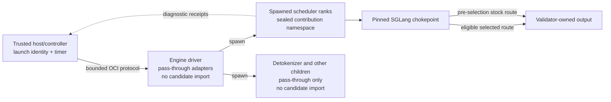

# SGLang seam

The seam connects Optima's stable slot ABI to version-pinned SGLang internals. It is intentionally split into two layers:

- [`slots.py`](https://github.com/latent-to/cacheon/blob/main/optima/slots.py) defines the stable miner-facing semantic contract;
- [`seams.py`](https://github.com/latent-to/cacheon/blob/main/optima/seams.py) defines the SGLang-specific adapter registry that must be reviewed whenever the runtime pin moves;
- [`seam.py`](https://github.com/latent-to/cacheon/blob/main/optima/seam.py) and the [`scheduler_gate` adapter](https://github.com/latent-to/cacheon/blob/main/optima/integrations/sglang_scheduler_gate.py) enforce activation and scheduler-only candidate loading.

Slots are the narrow waist. Adapters are replaceable glue.

## Why the seam exists

SGLang constructs the model in spawned scheduler processes. Patching a class in the parent process does not reliably reach those children, and importing candidate code into the parent would put the host timer inside the candidate's trust domain.

Optima therefore installs a small pass-through seam in every relevant interpreter and activates candidate implementations only inside the engine worker's scheduler ranks. The host controller and timing process never import contribution modules.



## One adapter table

`SEAM_ADAPTERS` is the single source of truth for:

- modules watched by the startup bootstrap;
- integration modules installed by `seam.activate()`;
- compatibility canaries run against the pinned SGLang revision;
- public binding identifiers and their fixed environment gates.

Adding an adapter is one table change plus its implementation and tests. Bootstrap, activation, and compatibility derive their vocabulary from that table rather than maintaining parallel lists.

The registered rows are:

| Adapter | SGLang chokepoint | Served slot or role | Public binding |
|---|---|---|---|
| `activation` | `SiluAndMul.forward_cuda` | `activation.silu_and_mul` | Registry-selected |
| `layernorm` | `RMSNorm.forward_cuda` | `norm.rmsnorm` | Registry-selected |
| `attention` | `RadixAttention.forward` | `attention.sdpa`, `attention.decode` | `attention` |
| `moe` | `FusedMoE.forward_impl` | `moe.fused_experts`, `moe.fused_experts_reduce` | `moe` |
| `collective` | `GroupCoordinator.all_reduce` | `collective.all_reduce` | `collective` |
| `arfusion` | `flashinfer_allreduce_residual_rmsnorm` | `collective.ar_residual_rmsnorm`; consume side for the deep epilogue | `arfusion` |
| `defer_gate` | `LayerCommunicator.should_fuse_mlp_allreduce_with_next_layer` | Deep epilogue producer/scoping gate | `arfusion` |
| `moe_export` | `flashinfer_cutlass_fused_moe` | `collective.moe_finalize_ar_rmsnorm` export wrapper | `arfusion` |
| `msa_prefill` | `flash_prefill_with_topk_index` | `attention.msa_prefill_block_score` | `msa_prefill` |
| `scheduler_gate` | `run_scheduler_process` | Positive scheduler-role candidate-load gate; not a slot | None |
| `artifact_context` | `ModelRunner.init_torch_distributed` | Rank-local sealed direct-artifact binding; not a slot | None |
| `resident_swap` | `ModelRunner.init_decode_cuda_graph` plus idle-gated scheduler cache flush | Persistent resident screening only; not qualification or a slot | None |
| `flashinfer_overlay` | FlashInfer `JitSpec` attribute | Reviewed dependency-patch consume side; not a slot | None |

Several adapters may share one binding when they implement one semantic product. The shallow AR-fusion consume adapter and both deep producer adapters share `arfusion`; activating only part of that set would violate the protocol.

The catalog can contain a verified slot before the pinned runtime exposes a safe live
chokepoint. `attention.msa_block_score` has a slot and verifier contract, while
[`sglang_msa.py`](https://github.com/latent-to/cacheon/blob/main/optima/integrations/sglang_msa.py)
refuses installation unless a stable decode-side MSA chokepoint is registered. The
prefill sibling has an installed adapter and appears in the table.

`resident_swap` is deliberately outside the crown path. It is inert unless the
validator supplies `OPTIMA_RESIDENT_SWAP` to a persistent screening engine. The
host stages a strictly increasing swap generation, triggers an idle-gated
recapture, and requires an acknowledgement from every scheduler rank. A failed
swap clears and disables the registry so the screen cannot measure a
half-installed contribution. Qualification launches never set this control
directory and never inherit screen evidence.

## Bootstrap across spawned processes

The primary installation path places `import optima.bootstrap` in a Python `.pth` file. Python executes the import at interpreter startup, including in spawned scheduler children.

The bootstrap remains import-light. It does not eagerly import Torch or SGLang.
Instead it installs a meta-path finder over the target modules derived from
`SEAM_ADAPTERS`. When one of those modules loads, the finder wraps its loader
and invokes `seam.activate()` after the original module body completes.

Activation is idempotent, but its name should not be read as “load the
candidate.” It installs whatever pass-through adapters are now available and
arms an eligible worker, then leaves the registry disabled. Candidate code is
loaded only when the `scheduler_gate` wrapper positively observes entry into
`run_scheduler_process` and calls `seam.load_candidate_bundle()`. This matters
because SGLang's detokenizer and other children also import watched modules;
import-triggered candidate loading there would put miner module code in the
output path downstream of sampling.

Each integration's `install()` function no-ops until its target module is
present and refuses duplicate patching. Repeated activation therefore installs
newly available adapters without stacking wrappers, while non-scheduler
children stay pass-through and never emit an `active` receipt.

SGLang versions that expose a plugin framework also have an [`sglang_plugin.py`](https://github.com/latent-to/cacheon/blob/main/optima/integrations/sglang_plugin.py) shim. The `.pth` bootstrap remains the general spawn-safe path across the supported pin.

Principal code: [`bootstrap.py`](https://github.com/latent-to/cacheon/blob/main/optima/bootstrap.py),
[`seam.py`](https://github.com/latent-to/cacheon/blob/main/optima/seam.py), and
[`sglang_scheduler_gate.py`](https://github.com/latent-to/cacheon/blob/main/optima/integrations/sglang_scheduler_gate.py).

## Closed activation vocabulary

The controller does not send arbitrary environment variable names across the worker protocol. It selects a sorted, duplicate-free set of public binding identifiers from the closed `SEAM_BINDINGS` vocabulary.

Inside the engine, each binding maps to one fixed gate:

| Binding | Fixed gate |
|---|---|
| `attention` | `OPTIMA_ATTENTION_SEAM` |
| `arfusion` | `OPTIMA_ARFUSION_SEAM` |
| `collective` | `OPTIMA_COLLECTIVE_SEAM` |
| `moe` | `OPTIMA_MOE_SEAM` |
| `msa_prefill` | `OPTIMA_MSA_PREFILL_SEAM` |

Normalization rejects unknown, duplicated, or non-canonical identifiers. Engine launch then emits the complete fixed seam environment, preventing stale ambient values from arming additional adapters.

The exact binding set is derived from the materialized stack and retained in launch identity. B and B′ use the same incumbent binding set. C differs only as required by its selected target delta. The pristine T reference has no candidate seam activation.

## Sealed contribution namespaces

The hardened path does not add an arbitrary miner directory to `PYTHONPATH`. `engine_tree.py` inspects contribution closure and emits each contribution under a deterministic namespace of the form `optima_c_<sha256>`.

At startup, `seam.py` exposes those namespaces only if all worker bindings agree:

- the process is explicitly marked as an engine worker;
- the bundle path is the fixed `/optima/engine-tree` mount;
- engine-tree and stack digests are canonical SHA-256 values;
- the mount is a concrete directory at its fixed path;
- for signed serving, the verified release descriptor digest matches the required digest.

The namespace finder resolves only sealed generated namespaces from that root. It does not make the rest of the mounted tree an unrestricted import location.

## Driver and scheduler roles

The engine driver is marked before SGLang import. Activation installs
pass-through dispatchers there but disables the registry and never loads
contribution code. This keeps wall-clock timing outside candidate control.

Spawned children also begin pass-through. Only a process entering the wrapped
`run_scheduler_process` is allowed to call `load_candidate_bundle()`. That
scheduler rank independently reopens the sealed engine tree, validates only
prebuilt/reviewed native products, loads contribution modules into generated
namespaces, registers eligible implementations, retries registry-dependent
adapter installation, and enables the registry. Detokenizers and other manager
children never cross this load gate. For signed serving, missing namespace,
activation, scheduler-gate installation, or required seam installation
terminates startup.

This separation is essential:

```text
driver/timer: adapters installed, registry disabled, no candidate import
other child:  adapters may install, registry disabled, no candidate import
scheduler:    positive process entry, sealed contribution loaded, registry enabled
```

### Trace one serving call

For a signed release, one successful candidate-backed call crosses the seam in this order:

1. The container entry point verifies the release, model, native artifacts, signed command,
   and required binding set before starting SGLang.
2. The startup bootstrap arms import hooks in each spawned interpreter without importing a
   contribution.
3. Spawned interpreters import watched SGLang modules. Original modules load first, then
   their pass-through adapters install once; this still does not import candidate code.
4. Only a scheduler rank enters wrapped `run_scheduler_process`. At that positive role
   boundary it calls `load_candidate_bundle()`, reopens `/optima/engine-tree`, verifies
   the expected tree/stack/release identities, and exposes only its sealed
   `optima_c_<sha256>` namespaces. Detokenizer/output-path children never do this.
5. At the pinned chokepoint, the adapter constructs a canonical descriptor from live
   tensors, topology, and engine state.
6. The dispatcher resolves an eligible registered variant, allocates the typed output, and
   invokes the contribution.
7. Output identity and layout are revalidated before returning to SGLang. The rank emits
   `fired` and `completed` receipts for the selected slot.

If step 5 finds no eligible candidate, stock routing before selection can be legitimate.
If steps 6 or 7 fail after selection, strict qualification and release-smoke policy do not
reinterpret the call as a successful candidate execution.

## Dispatch contract

Each adapter wraps one pinned chokepoint and delegates to a validator-owned dispatcher. The dispatcher:

1. derives a canonical call descriptor from live SGLang state;
2. resolves the target slot and variant against validator-owned eligibility;
3. allocates outputs and any workspace through the typed contract;
4. prepares layout-sensitive state through the registered prepare path;
5. invokes the candidate only after selection;
6. revalidates output storage, shape, dtype, device, stride, and layout;
7. returns the model-facing value in the exact form expected by SGLang.

Before candidate selection, ineligibility is normal stock routing. During crownable qualification, selected-path failures and fallbacks invalidate evidence; they must not silently become stock-vs-stock success. Collective selection is stricter: once ranks agree on a candidate route, a rank-local failure aborts the engine because peers may already be inside candidate communication.

The dispatch implementation is [`dispatch.py`](https://github.com/latent-to/cacheon/blob/main/optima/dispatch.py); registration and eligibility live in [`registry.py`](https://github.com/latent-to/cacheon/blob/main/optima/registry.py).

## Deep MoE epilogue

The deep epilogue crosses three SGLang points but remains one semantic path:

1. `defer_gate` decides whether the layer may defer its all-reduce and scopes the decision to the current forward/layer;
2. `moe_export` wraps fused-MoE execution and exports the validator-defined pre-finalize tensors;
3. `arfusion` consumes a pending deep export before considering the shallow AR+residual+RMSNorm route.

All three adapters share the `arfusion` binding. The state machine rejects stale, mismatched, or incorrectly scoped exports, and it vetoes an unsafe final-layer defer based on model-owned layer count.

The deep target may require a FlashInfer dependency overlay. That overlay is not an arbitrary runtime patch: a validator-shipped patcher applies an allowed source diff to a copied source tree during the reviewed build phase, the native artifact is sealed, and the `flashinfer_overlay` adapter redirects only registered late-bound JIT inputs. The installed dependency tree is not edited in place.

Principal code: [`moe_export.py`](https://github.com/latent-to/cacheon/blob/main/optima/moe_export.py), [`dep_policy.py`](https://github.com/latent-to/cacheon/blob/main/optima/dep_policy.py), and [`patchers/apply_dep_patch.py`](https://github.com/latent-to/cacheon/blob/main/optima/patchers/apply_dep_patch.py).

## Graph behavior

Adapters must preserve graph capture and replay semantics. Dispatch uses slot-declared graph-dynamic inputs, stable storage, and graph-safe candidate metadata. Qualification refreshes dynamic values in place and recomputes the trusted reference across replays.

An adapter that fires only in eager mode, captures a cached answer, mutates storage identity, or bypasses live replay is not qualified for a graphs-on arena. See [Slot contract](slot-contract.md) and [Graph safety](../miner-guide/graph-safety.md).

## Receipts and authority

Scheduler ranks can write process-local seam receipts:

- `active` — the sealed tree loaded and registered slots;
- `load_failed` — activation failed or registered nothing;
- `fired` — a dispatcher selected the candidate route;
- `completed` — the candidate produced the model-facing output;
- `fallback` — a selected route failed and a trusted fallback served in a non-strict context.

These receipts are valuable positive accounting. They catch phantom passes where a benchmark accidentally measures stock code. They are also used by the signed-release serve smoke to require active/routed/completed coverage and zero fallback.

The active-member gate expects exactly the registered tensor-parallel scheduler
ranks. Too few receipts means a scheduler did not activate; an extra receipt
means candidate code crossed into an unexpected process role. Either condition
invalidates coverage rather than being rounded away.

They are **not standalone crown authority**. Production qualification authority comes from the host-owned OCI lifecycle, bounded authenticated session protocol, device-state evidence, sealed role schedule, host timing, pristine T evidence, and reopened evidence products. A candidate process cannot crown itself by writing a plausible receipt file.

See [`receipts.py`](https://github.com/latent-to/cacheon/blob/main/optima/receipts.py), [`eval/oci_session_protocol.py`](https://github.com/latent-to/cacheon/blob/main/optima/eval/oci_session_protocol.py), and [`eval/qualification_runner.py`](https://github.com/latent-to/cacheon/blob/main/optima/eval/qualification_runner.py).

## Compatibility and upgrades

The seam is deliberately pinned-runtime code. An SGLang upgrade requires:

1. updating the explicit runtime pin and vendor provenance;
2. running the compatibility canary over every assessable adapter row;
3. reviewing changed chokepoints and call descriptors;
4. rerunning slot, graph, collective, engine, and failure-path tests;
5. recalibrating affected arena noise and quality profiles;
6. producing new runtime, engine-tree, native, and release identities.

Optional backend rows declare `requires` packages so CPU/dev environments can skip an unassessable adapter rather than report a false break. Production arenas that depend on that adapter must provide and assess the dependency.

!!! warning "Pin-validation boundary"
    A green import/chokepoint canary is necessary compatibility evidence, not proof that
    a pin preserves candidate execution and measured performance. Check
    [State of record](../reference/state-of-record.md) for completed evidence and
    [SGLang compatibility](../dev/sglang-tracking.md) for the complete validation ladder.

### Diagnosing a seam failure

Read receipts in lifecycle order instead of treating any single file as success:

| Last trustworthy observation | Likely boundary | What to inspect |
|---|---|---|
| No `active` receipt | Bootstrap, watched import, sealed namespace, or registration | Pin, adapter canary, worker role, tree/release digests, scheduler logs |
| `active`, no `fired` | Eligibility or wrong live chokepoint | Call descriptor, variant domain, topology, workload coverage, adapter firing |
| `fired`, no `completed` | Candidate execution or post-call validation | Exception, deadline, output storage/layout, rank agreement, device state |
| `fallback` after selection | Candidate route failed in a non-strict context | Preserve the failure; do not use the run as crown/release-smoke evidence |
| Full per-rank coverage, quality/speed fails | Seam worked; the contribution did not qualify | Qualification evidence and pristine T report, not bootstrap code |

A common diagnostic mistake is to stop at “the server answered.” Stock fallback can keep
a server responsive. Authority requires the expected slot-by-rank `active`/`fired`/
`completed` coverage and the absence of `load_failed` or `fallback`, followed by the
separate quality and performance gates.

## Source map

- [`seams.py`](https://github.com/latent-to/cacheon/blob/main/optima/seams.py) — adapter and binding source of truth
- [`bootstrap.py`](https://github.com/latent-to/cacheon/blob/main/optima/bootstrap.py) — startup/import hook
- [`seam.py`](https://github.com/latent-to/cacheon/blob/main/optima/seam.py) — activation and sealed contribution loading
- [`dispatch.py`](https://github.com/latent-to/cacheon/blob/main/optima/dispatch.py) — typed live dispatch
- [`integrations/`](https://github.com/latent-to/cacheon/tree/main/optima/integrations) — version-pinned SGLang adapters
- [`integrations/sglang_resident_swap.py`](https://github.com/latent-to/cacheon/blob/main/optima/integrations/sglang_resident_swap.py) — screening-only swap and graph-recapture hook
- [`compat.py`](https://github.com/latent-to/cacheon/blob/main/optima/compat.py) — pin and chokepoint canary
