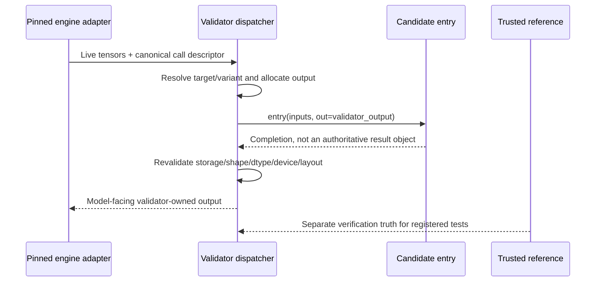

# Slot contract

The slot contract is Optima's narrow waist: a stable, validator-owned tensor boundary between untrusted optimization code and a pinned inference engine.

Slots may evolve, SGLang adapters may churn, and correctness policies may be
recalibrated. Every core slot must still satisfy the four invariants on this
page. This page is the normative checklist; the executable catalog is
[`optima/slots.py`](https://github.com/latent-to/cacheon/blob/main/optima/slots.py).

## The four invariants

### 1. The validator owns the boundary

The validator owns the call site and allocates every output tensor, including shape, dtype, device, stride, layout, and storage. The candidate entry point only fills the provided output. It does not allocate or return the result consumed by the model.

The same typed output contract is used by offline verification and the live engine binding. After execution, the binding revalidates output identity and layout before the engine consumes it.

### 2. The slot is strictly upstream of the sampler

A slot may replace a bounded data-plane region, but it may not control final logits, logprobs, tokens, or sampling. Its output continues through validator-owned or pinned-runtime computation before the final response exists.

For selection-style slots, the candidate fills an intermediate score sheet and the validator-owned tail performs the selection. This preserves the same property: the candidate never supplies the final selected output by assertion.

MSA keeps runtime selection width separate from verification policy. The live engine's
top-k controls the stock selection tail. `SlotSpec.correctness.top_k` only fixes the
width used when the verifier compares the highest-scoring blocks for overlap; equality
between those values is not a routing condition. The candidate always implements the
score-sheet boundary, not a miner-selected top-k operation.

### 3. Correctness uses trusted high-precision ground truth

Per-slot verification compares candidate output with a validator-owned fp32 or dequantized reference, never with the stock kernel as semantic truth. A faster implementation may use different reductions or low-precision arithmetic, so each slot selects an appropriate registered metric:

- `allclose` for elementwise-equivalent results;
- `matched_ratio` for numerically reordered kernels;
- `cosine` with an optional norm guard for low-bit outputs;
- `topk_overlap` for selection score sheets.

This cheap gate proves that the candidate computes the registered function. It is necessary but not sufficient: production qualification also applies pristine T quality authority to sealed end-to-end trajectories.

### 4. Miner-reported performance and evidence are not trusted

The host times requests outside the candidate process. The validator owns workloads, role schedules, output storage, reference work, evidence schemas, and verdicts. Candidate logs, self-reported throughput, and self-reported quality cannot mint a score.

A feature that cannot preserve all four invariants is not a core slot. It must use a fenced discovery or reviewed integration path.

## Slot kinds

The live catalog supports three kinds. Kind changes the breadth and capability of the boundary, not the trust model.

| Kind | Boundary | Additional requirement |
|---|---|---|
| `op` | One fused operation | Standard typed input/output verification |
| `block` | Several operations behind one bounded tensor contract | Explicit graph-safe behavior and end-to-end qualification |
| `collective` | A cross-rank operation or block that owns a communication step | Distributed verification, canonical live ABI, terminal all-rank selection, and end-to-end qualification |

## Current catalog

The current API contains **11 slots**.

| Slot | Kind | Entry point | Semantic boundary |
|---|---|---|---|
| `activation.silu_and_mul` | `op` | `silu_and_mul` | Gated MLP activation product |
| `norm.rmsnorm` | `op` | `rmsnorm` | RMS normalization; residual addition remains outside |
| `attention.sdpa` | `block` | `attention` | Scaled dot-product attention core |
| `attention.decode` | `block` | `attention_decode` | Paged decode-attention boundary |
| `attention.msa_block_score` | `block` | `msa_block_score` | MSA decode block-score sheet; validator owns top-k selection |
| `attention.msa_prefill_block_score` | `block` | `msa_prefill_block_score` | MSA chunked-prefill block-score sheet; validator owns top-k selection |
| `moe.fused_experts` | `block` | `fused_experts` | Prepared MoE expert execution |
| `moe.fused_experts_reduce` | `collective` | `fused_experts_reduce` | Prepared MoE experts plus owned trailing reduce |
| `collective.all_reduce` | `collective` | `all_reduce` | Cross-rank sum into a validator-owned output |
| `collective.ar_residual_rmsnorm` | `collective` | `ar_residual_rmsnorm` | Fused all-reduce, residual add, and RMSNorm |
| `collective.moe_finalize_ar_rmsnorm` | `collective` | `moe_finalize_ar_rmsnorm` | Deep MoE finalize, all-reduce, residual, and RMSNorm boundary |

Run `optima slots` against the installed code for the human-readable live list.
The command prints multi-line summaries rather than a JSON/structured schema;
automation should import the typed catalog instead of scraping this page or the
CLI output. Documentation should not be used to bypass catalog resolution.

## Typed call shape

`SlotSpec` binds every semantic detail needed by both verifier and live dispatch:

- canonical dotted name and kind;
- required `entry` callable and optional `prepare` callable;
- deterministic input generator and registered shapes;
- output shape or typed `OutputSpec` resolver;
- trusted reference invocation;
- candidate invocation adapter;
- graph-dynamic input names;
- correctness mode and dtype tolerances;
- optional slot-specific end-to-end quality threshold;
- collective reference and invocation hooks when applicable.

The target catalog freezes a stdlib-only projection of each live slot into `TargetContractRef`: input ABI, output ABI, reference, verification profile, binding family, graph inputs, correctness policy, tolerances, and optional quality threshold all contribute to the target specification digest. A target name alone is not enough.

### One call, end to end

For a non-collective slot such as `norm.rmsnorm`, the important sequence is:

Offline `verify` generates registered inputs, allocates the same typed output contract,
runs the candidate, and compares it with the trusted reference. Live dispatch derives the
descriptor from real SGLang state and uses the same output rules. Production qualification
then asks the broader question that per-call verification cannot answer: does the complete
engine preserve graph behavior and end-to-end quality while improving registered serving
workloads?

The candidate therefore never gets to say “this is the output,” “this call is eligible,”
or “this run passed.” It receives a bounded computation opportunity and a buffer; the
validator owns every surrounding decision.

## Prepare and forward

Layout-sensitive or quantized slots may define a `(prepare, forward)` pair. `prepare` runs once against raw validator-supplied checkpoint state and produces prepared state retained by the engine. `entry` receives that state on each forward call and still fills validator-allocated outputs.

This makes weight repacking, scale interleaving, or layout transformation attributable to the same bounded slot without granting a generic engine-wide setup hook. The live layer-to-contract mapping remains validator-owned.

## Collective contract

Collective candidates receive a process group, which is a wider capability. They therefore carry mandatory rules beyond the common invariants.

### Distributed verification

The single-rank `verify_entry` path refuses collective slots. The public
`optima verify` command routes them to `verify_collective`, which spawns the
requested world size, executes the real collective on every rank, and compares
every output with a trusted cross-rank fp32 reduction plus any registered
post-reduce transform.

### One canonical ABI

Offline verification and the SGLang binding derive the same call descriptor and typed output/workspace contract. The binding obtains rank and world size from the actual process group. Unsupported topology, missing fields, or an ineligible candidate route to stock before selection.

### Terminal selection

Candidate selection must agree across all ranks. Once all ranks select the candidate route, a rank-local prepare, allocation, execution, or validation failure aborts the candidate engine. A single-rank stock retry would deadlock or diverge from peers already inside the candidate collective, so fallback is no longer safe after selection.

### End-to-end qualification

Passing the distributed numerical check does not establish model quality or speed. Collective error can compound across layers, and topology controls performance. The candidate must still pass the registered full-engine bracket and pristine-reference quality policy.

The implementation is split between [`verify_collective.py`](https://github.com/latent-to/cacheon/blob/main/optima/verify_collective.py), [`dispatch.py`](https://github.com/latent-to/cacheon/blob/main/optima/dispatch.py), and the version-pinned adapters in [`integrations/`](https://github.com/latent-to/cacheon/tree/main/optima/integrations).

## CUDA graph contract

Production qualification is graphs-on. A candidate cannot earn authority by passing only eager execution when the arena serves captured graphs.

Each slot declares the tensor inputs whose values may change between replays while their addresses and shapes remain stable. Graph verification:

1. captures the candidate route;
2. mutates every declared dynamic input in place for each replay;
3. recomputes the trusted reference for the new values;
4. validates every replay output;
5. rejects cached-answer, stale-input, or graph-unsafe behavior.

Model weights and prepare-time state are capture-static. Python scalar changes require a different graph bucket unless the slot explicitly tensorizes them. Block and collective proposals must declare graph-safe behavior; the arena screen and retained qualification evidence bind the result.

See [Graph safety](../miner-guide/graph-safety.md) for bundle-facing guidance.

## Variants and eligibility

A slot may expose several implementation variants for disjoint, validator-observable capability domains such as dtype, shape, compute capability, or topology. Variants do not create new reward units: all rows for one semantic slot resolve to one singleton target.

Eligibility is evaluated before candidate selection. Unknown capability fields, overlapping ambiguous variants, unsupported topology, and missing prerequisites fail closed or route to stock according to the registered pre-selection policy. The miner cannot introduce a new capability vocabulary through manifest extras.

Runtime-owned tuning phases are also outside candidate eligibility. While FlashInfer is
profiling autotuner tactics, both the deep MoE producer seam and its fused-epilogue
consumer use the stock path. Candidate code cannot affect tactic selection, and those
calls do not establish candidate firing evidence.

## Atomic targets and composition

A slot is a semantic ABI; a reward target is an economic identity. Most current targets are one-to-one singleton projections of slots, but the catalog can register an atomic target spanning multiple slots.

`collective.moe_epilogue.v1` owns the pair:

- `collective.ar_residual_rmsnorm`;
- `collective.moe_finalize_ar_rmsnorm`.

The catalog explicitly records displacement of the corresponding singleton targets. It also defines first-applicable precedence for the compatible `moe.fused_experts_reduce` and `moe.fused_experts` targets. Packaging order never decides overlap or ownership.

See [Product model](product-model.md) and [`target_catalog.py`](https://github.com/latent-to/cacheon/blob/main/optima/target_catalog.py).

## Slot evolution

Adding or changing a slot is a validator code change. It requires coordinated updates to:

1. `SlotSpec` and its reference/shape/graph contract;
2. the target catalog's frozen contract projection;
3. offline and, for collectives, distributed verification;
4. the live SGLang seam adapter and dispatch path;
5. compatibility canaries against the pinned runtime;
6. graph, failure, fallback, and end-to-end tests;
7. arena policy and documentation.

The stable waist is the four invariants, not a promise that the catalog's set of slots will never grow.

## Escape hatches

Normal target submissions cannot request arbitrary engine-wide setup or framework mutation. Cross-cutting proposals use the discovery lane; source or dependency patching uses validator-shipped, policy-constrained patchers. Successful work should be resolved into a core slot, an atomic target, or reviewed product source without relabeling changed selected payload bytes under old evidence.

This keeps experimentation possible without widening every ordinary submission's authority.

## Failure behavior by phase

| Phase | Example | Required behavior |
|---|---|---|
| Manifest resolution | Unknown slot, ambiguous variant, stale contract digest | Reject before candidate execution |
| Pre-selection live routing | Shape or topology is outside a registered variant | Use the stock path when policy permits; do not count a candidate firing |
| Selected non-collective call | Candidate raises, corrupts output identity, or violates layout | In strict qualification, invalidate the candidate execution; a silent stock retry cannot produce crown evidence |
| Selected collective call | One rank fails after all-rank candidate selection | Abort the candidate engine; rank-local fallback is unsafe |
| Graph replay | Output reflects capture-time input after a declared dynamic tensor changes | Fail graph verification/screening |
| End-to-end quality | Per-slot numerics pass but sealed trajectory regresses | Fail under pristine T quality authority |
| Infrastructure | Worker, device, or evidence authority cannot establish a valid result | `NO_DECISION`, not an attributable candidate loss |

This distinction explains why “fallback exists” and “the candidate qualifies” are
different statements. Fallback can preserve availability in a non-strict serving or
development context. Crownable evidence must prove that the selected candidate route
actually fired and completed.

## Slot reviewer checklist

A new or changed slot is ready for a target only when a reviewer can answer yes to all of
the following:

- Is the semantic region bounded and strictly upstream of sampling?
- Are every output and workspace shape, dtype, layout, stride, device, and storage rule
  validator-owned and machine-checkable?
- Does the trusted reference express the intended function independently of the stock
  implementation?
- Are capability domains finite, unambiguous, and observable before selection?
- Are graph-dynamic inputs complete, with capture-and-mutate replay coverage?
- If communication is owned, do offline and live paths share one distributed ABI and
  terminal all-rank selection rule?
- Is there a real pinned-runtime chokepoint, or is the catalog entry explicitly marked as
  verifier-only until one exists?
- Do strict-mode receipts and end-to-end qualification prove that the candidate path fired
  without fallback?
- Has the target catalog encoded overlap, displacement, requirements, and composition
  rather than relying on bundle order?

Passing a unit test without these properties is not sufficient to extend the narrow waist.

## Source map

- This page — normative invariants
- [`slots.py`](https://github.com/latent-to/cacheon/blob/main/optima/slots.py) — executable slot catalog
- [`tensor_spec.py`](https://github.com/latent-to/cacheon/blob/main/optima/tensor_spec.py) — typed outputs and workspaces
- [`verify.py`](https://github.com/latent-to/cacheon/blob/main/optima/verify.py) — op/block verification and graph replay
- [`verify_collective.py`](https://github.com/latent-to/cacheon/blob/main/optima/verify_collective.py) — distributed verification
- [`target_catalog.py`](https://github.com/latent-to/cacheon/blob/main/optima/target_catalog.py) — economic target projection
