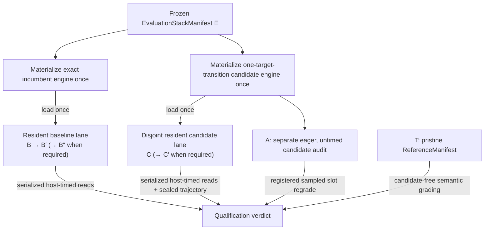

# Stacks and manifests

Optima represents evaluation state, product state, and semantic reference state as separate content-addressed objects. This makes it impossible to confuse “currently winning in the referee” with “reviewed and shipped.”

## The three manifest roles

### Evaluation stack

`EvaluationStackManifest` is the complete incumbent used by the referee. It binds:

- the pinned runtime digest;
- the base engine digest;
- one registered arena digest;
- the exact target-catalog snapshot and digest;
- the active contribution reference for each target.

An evaluation entry may be a hostile `ProposalContributionRef` or an already integrated contribution. Proposal references remain legal only because the whole stack is materialized and executed inside the hostile evaluation boundary.

The evaluation stack is arena-specific. A result against one runtime, base engine, catalog, or arena cannot update another stack by name alone.

### Engine release stack

`EngineReleaseManifest` is the chain-independent product identity. It binds the runtime, base engine, catalog, and active entries but accepts `IntegratedContributionRef` values only. Each reference must be covered by an exact approved `IntegrationReviewRecord`.

The release manifest is not mutated when the referee crowns a proposal. It changes only through a reviewed product decision.

### Reference manifest

`ReferenceManifest` identifies the pristine validator-owned semantic authority used by qualification. It is candidate-free and untimed. It binds the trusted reference engine and the quality policy used to grade sealed candidate trajectories.

The reference does not compete on speed and is not the incumbent B′. This prevents an untrusted incumbent from becoming its own correctness oracle.

| Property | Evaluation stack | Engine release stack | Reference |
|---|---:|---:|---:|
| Hostile proposal entries allowed | Yes | No | No |
| Bound to one arena | Yes | No | Quality profile |
| Timed | B/C/B′ | Release checks only | Never |
| Can update after a crown | Transactionally | No | No |
| Can be served as product | No | Yes, after signed publication | No |

## Canonical identity

Manifests are serialized with canonical JSON and domain-separated SHA-256 digests. Identity includes the complete catalog snapshot, not only a friendly target name. Unknown fields, stale schema versions, mismatched context digests, duplicate entries, and malformed contribution references fail closed.

This closes several ambiguity classes:

- a target cannot change meaning while retaining its name;
- an arena cannot silently change workload or topology under retained evidence;
- an integrated contribution cannot be substituted for another source tree with matching labels;
- manifest map order cannot alter identity;
- a candidate cannot claim a different target after measurement.

Canonical digest construction lives in [`stack_identity.py`](https://github.com/latent-to/cacheon/blob/main/optima/stack_identity.py); strict manifest types live in [`stack_manifest.py`](https://github.com/latent-to/cacheon/blob/main/optima/stack_manifest.py).

### Stack digest, tree digest, and running-engine identity

These three identities answer different questions and should appear together in an audit:

| Identity | Answers | Changes when |
|---|---|---|
| Stack manifest digest | Which semantic contributions and catalog are selected? | A target entry, runtime/base identity, arena context, or catalog snapshot changes |
| Engine-tree digest | Which exact deterministic materialized files were emitted? | Selected source closure, direct-execution declaration, namespace rewriting, rebuild plan, or emitted inventory changes |
| Launch identity | Which exact engine was executed? | Tree, native publication, model, image, topology, graph mode, workload, or role changes |

Equal stack digests are not enough to claim equal execution if launch inputs differ. Equal
tree digests are not enough if a different model, native publication, or topology ran.
Conversely, a proposal tree and a reviewed release tree can preserve the same crowned
selected payload while differing in reviewed packaging and therefore having different
tree identities.

## Exact marginal substitution

The validator derives a candidate arm from the frozen incumbent. A valid registered-target arm changes exactly one target transition.



The target catalog determines the transition:

- a singleton replaces one slot target;
- an atomic target replaces its registered member set and displaces the overlapping singleton targets;
- compatible targets use explicit validator-owned composition precedence;
- required targets and displacement closures are validated before planning;
- unregistered work is routed through the discovery planner, not disguised as a singleton.

The planner records both the old and new contribution references, the selected-delta digest, the exact target specification, and the expected execution order. See [`stack_plan.py`](https://github.com/latent-to/cacheon/blob/main/optima/stack_plan.py).

### Concrete substitution example

Suppose incumbent manifest `E0` contains targets `activation.silu_and_mul = A` and
`norm.rmsnorm = R0`. A proposal resolves exactly to the RMSNorm singleton as `R1`.
Planning produces:

```text
incumbent = materialize(E0)                         # A + R0; load once on baseline lane
candidate = materialize(replace(E0, rmsnorm, R1))  # A + R1; load once on candidate lane
B/B′[/B″] = serialized reads from incumbent        # opening, closing, optional repeat
C[/C′]    = serialized reads from candidate        # initial and optional repeat
A         = separate eager, untimed candidate audit
T         = materialize(pristine reference)        # neither proposal is a grading oracle
```

The validator, not the proposal, performs `replace`. A bundle that also declares an
activation implementation cannot silently widen this arm: it either fails exact target
resolution or enters an explicitly registered wider target/discovery path. If C passes,
the transition record names `R0 -> R1`; it does not give R1 ownership of A or of the
complete emitted engine tree.

For an atomic target, the same rule applies to the target's entire registered member set.
The replacement is still one economic transition, but all displaced overlapping entries
must be validated and recorded together.

## Cohorts

The routing screen may amortize a frozen incumbent across a chain-ordered cohort
`C1..Ck`. Cohorting does not weaken marginal identity:

- every candidate is derived from the same frozen incumbent digest;
- each candidate still changes one registered target or one discovery identity;
- candidate order is derived from committed authority rather than network arrival;
- shared screen brackets remain routing evidence only;
- each promoted candidate receives a fresh authoritative qualification whose
  B/B′ bookends and optional B″ repeat are the exact incumbent;
- the retained qualification evidence binds each candidate to its own selected
  delta and physical-lane role assignment;
- drift outside the registered envelope yields `NO_DECISION` for the affected authority.

Cohorting is a scheduling optimization, not an economic change. Direct AOT,
dependency-patch, native-rebuild, and setup-hook contributions are not
hot-swappable; they receive an explicit screen waiver and proceed to the same
authoritative qualification rather than inheriting a synthetic screen result.

## Deterministic engine materialization

`engine_tree.py` turns a stack manifest into a closed engine source tree. Materialization does more than copy bundle directories:

1. reopen and inspect each referenced contribution;
2. verify source, metadata, CUDA, include, import, variant, and rebuild closure;
3. bind every contribution to its content and target-spec digests;
4. rewrite local Python and native names into deterministic contribution namespaces;
5. emit one canonical runtime manifest and rebuild plan;
6. record every emitted file and compute the logical tree digest;
7. reopen the emitted tree before it is accepted by launch or release code.

Integrated contributions take a stricter path. Promotion binds reviewed repository state, the byte-preserved selected payload, surrounding packaging, artifacts, tests, license/provenance assertions, and immutable attribution into an `IntegrationReviewRecord`. A release tree can resolve source only through approved integrated references.

The resulting tree digest is separate from the stack digest. The stack identifies semantic composition; the tree identifies the exact emitted filesystem used to build and launch it. Both are retained.

## Seam bindings are part of execution identity

Engine launch policy resolves the stack's active contributions to a closed, validator-owned set of seam binding identifiers. Those public identifiers map to fixed environment gates inside the engine. Arbitrary environment variable names do not cross the controller/worker protocol.

This guarantees that B and B′ receive the same incumbent bindings and C receives only the binding change implied by its exact target delta. T has no candidate binding. See [SGLang seam](seam.md).

## Build and launch identity

Materialized source is only one part of a running engine. The launch authority also binds:

- base image and runtime identity;
- model and tokenizer identity;
- topology and device allocation;
- native build specification and reopened publication digest;
- graph mode and relevant engine flags;
- workload, prompt, and role schedule;
- bounded host/worker protocol and evidence keys.

The controller prepares these inputs before timed execution. Production
qualification binds two isolated resident TP lanes and serializes GPU work
across them. Its adaptive schedule begins with B/C/B′ and may add C′/B″ under
the frozen escalation policy. Independent reproduction must exchange the
physical incumbent and candidate lane roles.

A separate
no-GPU/no-network prebuild OCI compiles registered native products and publishes
them for reopening. The disposable runtime worker mounts that publication
read-only; its scheduler ranks may import sealed candidate Python, validate and
load native products, construct the engine, and execute, but they must never
compile or repair native code. Host-side timing and authenticated evidence bind
the runtime result back to the prepared launch identity.

Principal implementations are
[`eval/crossover_runtime.py`](https://github.com/latent-to/cacheon/blob/main/optima/eval/crossover_runtime.py),
[`eval/engine_launch.py`](https://github.com/latent-to/cacheon/blob/main/optima/eval/engine_launch.py),
[`eval/native_artifact.py`](https://github.com/latent-to/cacheon/blob/main/optima/eval/native_artifact.py),
and [`eval/oci_backend.py`](https://github.com/latent-to/cacheon/blob/main/optima/eval/oci_backend.py).

### Direct-artifact identity across the stack

A direct artifact is not identified by its CUBIN name or `ops.entry`. Its
canonical execution identity covers the provider, compiler factory, allowed
profile inputs, ordered bindings, lifecycle plan, specialization predicates,
prelaunch operations, validator-owned resource plan, derived capability
requirements, and complete device launch plan. That projection is included in
the selected contribution and selected-delta identities used to materialize the
engine tree.

The target catalog separately binds the immutable provider-registry snapshot and
digest. Launch preparation then adds the measured compile profile, native build
specification, sealed publication digest, and exact file inventory. Runtime
admission adds driver-observed CUBIN ABI and contract digests, while execution
receipts prove that the selected entry loaded, ran, and completed on every active
member without fallback.

These layers answer different questions:

| Layer | Bound authority |
|---|---|
| Contribution | Exact declarative device execution and source closure |
| Catalog | Which artifact providers and target features are permitted |
| Build | Image, logical/compiler architecture, topology-derived profile, patcher, and publication |
| Runtime | Exact retained CUBIN handle, observed ABI, rank device, parameters, resources, and lifecycle |
| Qualification | Full member coverage, successful invocation, seam completion, and zero fallback |

See [Sealed direct artifacts](direct-artifacts.md) for the complete contract.

## Transactional stack updates

A passing qualification does not immediately mutate the incumbent. The settlement path requires two independently selected and reopened passing qualifications for the exact same reproduction identity.

The equal core `SettlementReproductionIdentity` contains the arena digest,
target ID, selected-delta digest, hotkey, incumbent stack/tree digests, and
candidate stack/tree digests. The pair must also match broader contribution,
reservation, finalized-priority, manifest, member, and arm fields. Separately,
all seven authority/selection fields must differ: qualification authority,
plan, attempt, report, selection commitment, selection-secret commitment, and
selection evidence. Settlement conservatively uses the lower of the two
accepted speedups.

Only after both evidence roots reopen and agree does settlement:

1. revalidate the target transition against the current stack;
2. project the crown and attributable credit;
3. write the transition and settlement evidence transactionally;
4. expose the new evaluation stack as the current incumbent.

If validation, persistence, or readback fails, the old stack remains authoritative. Rollback is itself a planned, content-addressed transition rather than an in-place edit. See [`settlement.py`](https://github.com/latent-to/cacheon/blob/main/optima/settlement.py) and [`chain/intake.py`](https://github.com/latent-to/cacheon/blob/main/optima/chain/intake.py).

### Failure behavior

| Failure | Resulting authority |
|---|---|
| Candidate tree cannot be reopened | No valid C arm; qualification does not begin or returns `NO_DECISION` according to stage policy |
| B and B′ do not reopen the same incumbent | Cohort authority is invalid; no candidate in the affected comparison can be crowned |
| Catalog changed after a qualification | Retained evidence remains historical, but it cannot be replayed as a transition against the new catalog by name alone |
| Second pass names a different reproduction identity | The pair is not settleable |
| Current incumbent changed before settlement | Transition is replanned/revalidated; stale evidence does not overwrite the live stack |
| Database transaction or evidence readback fails | The previous stack remains current and reward projection is held |

An operator should never “repair” these cases by editing a manifest digest or copying a
directory into the expected path. The mismatch is the evidence that the attempted state
transition lacks authority.

## Release promotion

Promotion does not copy a hostile proposal reference into a release manifest. It produces a new integrated reference from reviewed source, then requires exact review coverage for every release entry. The engine tree is rematerialized from those integrated sources and bound into the release descriptor.

This yields a one-way authority boundary:

```text
proposal reference -> crown evidence -> integration review -> integrated reference -> release manifest
```

There is no supported arrow from a mutable miner URL, chain record, or evaluation bundle directly to serving.

## Source map

- [`stack_manifest.py`](https://github.com/latent-to/cacheon/blob/main/optima/stack_manifest.py) — strict manifest and contribution-reference types
- [`stack_plan.py`](https://github.com/latent-to/cacheon/blob/main/optima/stack_plan.py) — marginal arms, cohorts, transitions, and rollback
- [`engine_tree.py`](https://github.com/latent-to/cacheon/blob/main/optima/engine_tree.py) — deterministic source materialization and integration promotion
- [`target_catalog.py`](https://github.com/latent-to/cacheon/blob/main/optima/target_catalog.py) — singleton, atomic, overlap, and composition policy
- [`artifact_identity.py`](https://github.com/latent-to/cacheon/blob/main/optima/artifact_identity.py) — canonical direct-artifact execution identity
- [`artifact_provider.py`](https://github.com/latent-to/cacheon/blob/main/optima/artifact_provider.py) — closed provider registry included in catalog identity
- [`eval/reference_quality.py`](https://github.com/latent-to/cacheon/blob/main/optima/eval/reference_quality.py) — pristine reference quality products
- [`eval/calibration.py`](https://github.com/latent-to/cacheon/blob/main/optima/eval/calibration.py) — calibrated qualification/reference policy
