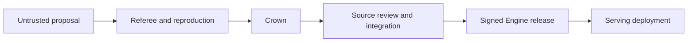

# Optima Engine

Optima Engine is the chain-independent inference product contract: a
content-addressed execution stack built around a pinned SGLang runtime and reviewed
performance contributions. A completed release is designed to be rebuilt, verified,
and served without chain access, miner hosting, or a validator wallet.

The repository implements release manifests, deterministic materialization, signing,
verification, model/native publications, OCI context generation, registry inspection,
and serving-receipt primitives. This revision does not claim a completed production
release, an authorized deterministic registry image, or a complete all-rank serving
receipt set. See [State of record](../reference/state-of-record.md) for the current
closure boundary.

The proposal market is how the Engine discovers and measures possible
improvements. It is not part of the serving dependency graph.

For an operator, the release contract is a locked execution bill of materials: a
conforming release says **which reviewed Python/native implementation, which upstream
runtime, which model bytes, which serving arguments, and which security policy belong
together**. The signature authenticates that statement and reopen verification checks
that the supplied filesystem still matches it. Serving receipts are required evidence
that selected seams fired, but the current primitives do not by themselves establish
the complete causal release/session authority. None of these checks can be replaced by
a mutable image tag or a claim that “this commit was benchmarked.”

Every arrow is a separate decision. In particular:

- a proposal may fail, receive no decision, or wait for reproduction;
- a crown may never be accepted for integration;
- an integration may wait for a compatible release train;
- a release may be verified without being deployed.

## Release contents

A conforming completed release binds all inputs needed to understand and reconstruct
its runtime identity:

- an integrated-only `EngineReleaseManifest` and deterministic Engine tree;
- reproducible Optima source distribution and wheel;
- an exact external model-provisioning receipt;
- an immutable native build specification and artifact publication;
- the reviewed seccomp profile;
- reference and calibration manifests;
- SPDX SBOM and SLSA-style provenance;
- every integration review record;
- a digest-pinned base image and canonical serving specification;
- a canonical release descriptor and Ed25519 signature, authenticated with an
  expected public key obtained through an external trust channel.

The publication API treats the release tree as immutable and freezes regular
files read-only. The filesystem owner can still alter directory entries, so
the actual boundary is tamper evidence: verification reopens every typed
object, hash, inventory, integration binding, native artifact, and signature
rather than trusting modes, filenames, or build logs.

### How the pieces answer different questions

| Product | Question it answers |
|---|---|
| `EngineReleaseManifest` | Which reviewed contribution owns each active target? |
| Engine-tree digest | Which exact deterministic materialized source tree implements that composition? |
| Model receipt | Which exact model files are mounted? |
| Native publication | Which prebuilt architecture-specific products may be loaded? |
| SBOM and provenance | Which declared inputs and build lineage produced the release artifacts? |
| `ServeSpec` | Which image, platform, topology, command, environment, and mount contract may run? |
| Signed descriptor | Who authorized this exact closed set of identities? |
| Registry reproducibility statement | Did two reopened registry manifests expose the same raw image digest and required labels? |
| Serve receipts | Did the supplied receipt set report active, fired, and completed coverage for every expected slot and tensor-parallel rank? |

These products compose; they are not interchangeable. For example, a valid signature
over a descriptor with a missing model tree still cannot start, and a responsive server
with fallback receipts has not proved that the released optimization executed.
Complete deployment authority must additionally bind both registry readbacks to their
controlled builder invocations, bind smoke receipts to the exact release and serving
session, and require direct-AOT load/invocation evidence when the release declares it.
Those causal bindings are not established by the registry or receipt primitives alone.

## Native and dependency artifacts

Architecture coverage is explicit rather than inferred from the machine that performed
the build. The FlashInfer dependency-patch path publishes one sealed overlay containing
the validator-declared `sm100` and `sm103` fused-MoE modules. FlashInfer captures its CUDA
architecture list in import-time state, so each module is compiled in a separate hermetic
child interpreter whose environment is fixed before any FlashInfer import; the parent
build process never imports FlashInfer. The build child compiles but does not load the
module. At engine startup, the installer selects only the row matching the current device
and refuses an architecture that the publication does not cover.

This multi-architecture dependency overlay is distinct from a sealed direct artifact: it
patches a closed dependency subtree and publishes exact prebuilt dependency modules,
while a direct artifact is admitted through its registered provider, slot ABI, compile
profile, resource plan, and launch plan.

FlashInfer autotuning is a runtime-owned phase. While its tactic profiler is active, both
the deep MoE producer and the fused-epilogue consumer stay on the stock path. A reviewed
or candidate implementation cannot influence tactic selection, and autotuner calls do
not count as proof that an Optima seam fired.

## Serving boundary

The Engine owns inference execution: registered kernels and blocks, attention,
MoE, collectives, graph plans, and bounded execution-adjacent changes that are
required to realize those improvements.

The surrounding service remains responsible for HTTP/API behavior,
authentication, tokenization policy, request admission, fleet orchestration,
autoscaling, observability, and operational lifecycle. A release produces a
deterministic OCI build context; it does not prescribe the entire service
control plane.

## Trust boundary

A conforming release contains only reviewed, integrated source. The selected payload
bytes remain bound to the crowned digest; surrounding packaging and the later
materialized namespace may be normalized. Hostile proposal references belong to
`EvaluationStackManifest` and may execute only in the referee's disposable candidate
engines. They cannot appear in an `EngineReleaseManifest`.

This separation is what makes both sides honest:

- the referee can evaluate a crowned proposal without pretending it is safe to
  ship;
- the serving product can accept reviewed improvements without depending on
  chain state or mutable proposal storage.

## Release-consumer procedure

For a release that has completed every required authority gate, a consumer does not
need to trust the release directory's filename or the registry tag:

1. Obtain the expected public key and descriptor digest through an independent trusted
   channel.
2. Reopen the publication and verify every descriptor-bound artifact and integration.
3. Materialize a deterministic context, build twice, and authorize the common immutable
   registry digest.
4. Mount the exact provisioned model and create a container whose inspected host policy
   matches the signed serving specification.
5. Start a canary, exercise it, and require complete positive seam receipts with no
   `load_failed` or `fallback` result.
6. Promote or roll back by immutable release/image identity. Never repair the signed tree
   or replace a file in place.

If an operator already has a previously verified release, failure at any step leaves
that prior release unchanged. The procedure does not ask the chain which code to run
and does not downgrade to a hosted miner bundle.

Next: [Integrating a contribution](integration.md) or
[Build and sign](release-workflow.md).
