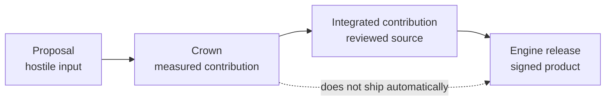

Bounded proposals · isolated evaluation · reviewed release boundary

# From untrusted GPU proposals to measured contributions.

Optima measures untrusted GPU optimization proposals as attributable contributions
and defines a separate review and release path for **Optima Engine**. SGLang owns
the serving control plane; Optima's contribution boundary is the inference data
plane. The current revision does not claim a completed production Engine release.

[Build a kernel](miner-guide/overview.md){ .md-button .md-button--primary }
[Operate the referee](validator-guide/overview.md){ .md-button }
[Understand the architecture](architecture/overview.md){ .md-button }

At the highest level, Optima has two systems: the chain-independent product and
the market that improves it. Operationally, the market side separates the
subnet control plane from the hostile-code referee, giving readers three
cooperating surfaces with different trust boundaries.

<a class="optima-card" href="engine/overview/">
<strong>Optima Engine</strong>
The chain-independent release contract: reviewed source, pinned runtime, sealed model identity, and signed authority.
</a>
<a class="optima-card" href="architecture/pipeline/">
<strong>The referee</strong>
Isolated, evidence-producing evaluation of one marginal target delta against a validator-owned incumbent stack.
</a>
<a class="optima-card" href="validator-guide/chain-loop/">
<strong>The subnet</strong>
Finalized proposal ordering, attribution, economic settlement, and weight publication. It is not part of the serving product.
</a>

## One idea, four objects

The system keeps four objects deliberately separate:

A miner submits a **proposal** for one registered target delta, or a bounded discovery
prototype through the separate discovery ABI. The referee may establish a **crown**
after two independent passing qualifications. Optima maintainers may then turn the
proposal into an **integrated contribution** after security, provenance,
compatibility, and maintenance review. Only integrated contributions may enter a signed
**Engine release**. Discovery policy defines reviewed promotion and bounded-bounty
outcomes, but the durable registered-promotion transport is not implemented and fails
closed; the implemented disposition path is bounty-only. Discovery is not another
standing target family.

[Learn the product model →](architecture/product-model.md)

## Why the architecture is composable

Every candidate runs as a complete isolated engine, but it is rewarded only for the
smallest validator-controlled delta it contributes. Authoritative qualification uses:

- **B** — the exact incumbent evaluation stack;
- **C** — the same stack with one registered target replaced;
- **B′** — an incumbent bookend;
- **C′/B″** — conditional repeat reads collected only when the frozen
  escalation policy requires them;
- **A** — a separate eager, untimed sampled-audit role when registered; and
- **T** — a candidate-free pristine reference that grades sealed trajectories after
  candidate destruction.

Primary and reproduction attempts also exchange incumbent and candidate
physical-lane roles. A persistent hot-swap screen may route candidates before
this schedule, but its measurements cannot qualify or settle a contribution.

This separates the **execution unit** (a complete disposable engine) from the
**economic unit** (one singleton target, atomic target, or bounded discovery
contribution). A new optimization can build on previous wins without repackaging or
copying them.

[Follow a proposal through the system →](architecture/pipeline.md)

## Choose your path

| Goal | Start here |
|---|---|
| Write a Triton, CuTeDSL, or Python reference kernel | [Miner guide](miner-guide/overview.md) |
| Validate the repository locally without a GPU | [Local quickstart](get-started/quickstart.md) |
| Deploy intake, an arena provider, and qualification workers | [Validator guide](validator-guide/overview.md) |
| Understand or verify the Engine release contract | [Optima Engine](engine/overview.md) |
| Audit trust boundaries and failure behavior | [Security model](security/threat-model.md) |
| Check what is implemented, measured, and still unproven | [State of record](reference/state-of-record.md) |

## Evidence is scoped, not blended

Every performance or authority claim is scoped to the exact runtime, hardware, arena,
stack, identities, and procedure that produced it. Diagnostic measurements cannot
authorize a crown; crown evidence cannot authorize reviewed source; and release
verification cannot retroactively validate qualification. The
[state of record](reference/state-of-record.md) identifies which evidence products have
actually been retained for each boundary.

!!! note "Source of executable truth"
    This [Cacheon repository](https://github.com/latent-to/cacheon) owns both
    executable contracts and this documentation. Content-addressed production
    evidence and immutable publications live in separate operator-owned stores.
    When prose and code disagree, the code, schemas, and tests in the same
    revision take precedence.
