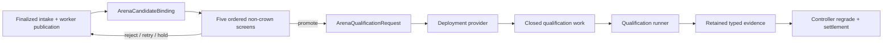

# Arena service types

An arena service is the validator-owned admission, screening, and
qualification-planning boundary for an admitted proposal. The downstream
qualification and durable controller produce and settle authoritative evidence.
Public CLI arguments cannot construct the service.

## Where the boundary sits



The arena service decides whether and how a finalized candidate reaches the
qualification runner. It does not decide the economic result. This split lets
deployment code own GPUs, model paths, entropy, hidden judges, and executors
without letting an arbitrary provider return “crown = true.”

## Closed registry

Production deployment injects an `ArenaServiceRegistry` into the validator
loop. The registry maps preconfigured arena IDs to typed services. A service
binds an exact runtime and workload identity, capacity and screen policy,
qualification-policy digest, and reviewed provider identity. The provider
returns the closed executor, entropy, hidden-judge, deadline, and plan-factory
work needed by the qualification runner.

`chain-validate --arena-id <id>` selects an already injected service. Unknown
IDs fail closed. Without an injected registry, only `--intake-only` is a valid
public operation. Optima deliberately ships no general production
`ArenaServiceProvider` and no `--eval-cmd` shell escape hatch.

### Manifest anatomy

An `ArenaServiceManifest` is path-free and content-addressed. Its main sections
are:

| Section | Bound decisions |
|---|---|
| `ArenaRuntimeIdentity` | Arena ID; runtime/base/overlay/worker digests; exact model identities; architecture; topology; GPU and TP sizes |
| `WorkloadMixture` | Prompt-corpus digest and seed scheme; weighted decode and long-prefill regimes; exact serving shapes |
| `ArenaCapacityPolicy` | Queue depth/age, concurrent screen and qualification limits, cohort size, and retry budgets |
| `NonCrownScreenPolicy` | Exactly ordered static, build, ABI, graph, and abbreviated-serving stages with timeouts |
| Qualification/provider digests | Exact qualification policy and reviewed provider implementation identity |

Workload weights sum to one million parts per million and must cover both
decode and long-prefill. Tensor parallel size cannot exceed the bound GPU
count. These checks turn “same arena” into a typed identity rather than an
operator nickname.

## Boundary types

| Type | Role |
|---|---|
| `ArenaServiceRegistry` | Closed mapping supplied by deployment code |
| `ArenaService` | Typed screening and qualification-planning boundary for one arena |
| `ArenaServiceManifest` | Frozen runtime, workload, capacity, screens, and policy identity |
| `ArenaCandidateBinding` | Exact qualification reservation, immutable publication, and screen attempt handed to a service |
| `ArenaScreenReceipt` | Typed results from the five non-crown screening stages |
| `ArenaQualificationRequest` / `ArenaQualificationWork` | Closed request and provider-returned qualification plan |
| `ArenaServiceProvider` | Deployment-supplied in-process protocol; no production implementation ships in the repository |

The provider protocol has only two authority-bearing operations:

```python
def run_screen(manifest, stage, candidate) -> ScreenStageResult: ...

def build_qualification(request, state=None) -> ArenaQualificationWork: ...
```

`ArenaService` checks the provider digest on construction, requires the exact
requested screen stage back, converts an over-time result to `NO_DECISION`,
and verifies that qualification work preserves policy digest and finalized
reservation order. Submission metadata never supplies a Python module or
entry point for this provider.

Operators should construct these exact types in reviewed deployment code, not
deserialize arbitrary contributor configuration into service objects. Final
`PASS`/`FAIL`/`NO_DECISION` authority is represented by qualification evidence
types, not by a generic arena outcome object.

## What the service owns

- exact runtime, base-engine, model, worker, architecture, and topology identity;
- the decode/long-prefill workload mixture;
- queue depth/age, cohort size, active screen/qualification, and retry bounds;
- the fixed static/build/ABI/graph/abbreviated-serving screens;
- qualification-policy and provider digests; and
- a closed qualification plan and its executor/entropy/hidden-judge authorities.

Submissions cannot weaken or select these values.

Durable intake state, evidence reopening, independent reproduction,
transactional settlement, evaluation-stack transition, and weight publication
remain separate controller responsibilities. An `ArenaService` cannot crown or
settle a proposal by returning a screen or plan.

## Admission and capacity

Admission has three typed outcomes before evidence exists:

| Decision | Typical cause | Controller behavior |
|---|---|---|
| `ADMIT` | Screen/qualification capacity is available | Reserve work under the bound service |
| `QUEUE` | The relevant active-worker capacity is temporarily full | Preserve finalized priority and retry later |
| `HOLD` | Queue depth/age or cohort size crosses admission policy | Stop automatic progress pending operator/policy handling |

Screen and qualification capacities are distinct. A cohort larger than
`max_cohort_size` is held; a cohort that fits policy but would exceed current
active qualification capacity is queued. A resident screen promotion is also
capped by both the registered policy and the provider's current service
capacity. This avoids converting overload into candidate failure.

Retry exhaustion is post-evidence policy, not an admission input. After a screen or
qualification produces `NO_DECISION`, `retry_disposition()` returns the separate
`PromotionDecision.RETRY` while the lane-specific attempt is below budget, otherwise
`PromotionDecision.HOLD`.

## Screen receipt derivation

The screen receipt must be a canonical prefix of the fixed stage order. Every
earlier result must be PASS, and the last grade determines the only legal
decision:

| Terminal stage grade | Receipt decision | Economic meaning |
|---|---|---|
| All five PASS | `PROMOTE` | Eligible to request full qualification; no score or crown |
| First authoritative FAIL | `REJECT` | Candidate failed a registered non-crown gate |
| `NO_DECISION` within retry budget | `RETRY` | Infrastructure/incomplete authority; try again |
| `NO_DECISION` after budget | `HOLD` | Automatic retry stops without assigning a loss |

A provider cannot skip static and report a graph result, reorder stages, attach
another candidate digest, or promote an incomplete prefix.

The fifth, abbreviated-serving stage may use the persistent resident screen lane. That
lane swaps a safely swappable bundle, recaptures graphs, and grades it against shared
stock brackets and canaries. A direct AOT artifact, dependency patch, native rebuild, or
setup hook receives a typed waiver for this stage and advances to dedicated qualification;
the waiver is not represented as fabricated performance evidence. Screen receipts and
waivers remain routing products only.

## Outcome semantics

`PASS`
: The run established every registered qualification predicate. A first PASS
  becomes `reproduction_pending`; it is not a crown.

`FAIL`
: Authoritative evidence established a candidate defect or failure to clear the
  registered bar.

`NO_DECISION`
: Infrastructure, drift, incomplete evidence, or another non-candidate
  condition prevented a valid decision. It must not be rewritten into a loss
  or a crown.

The controller reopens and regrades retained evidence rather than trusting an
evaluator's summary text.

## Deployment review checklist

- Construct the registry from a sorted, unique, reviewed arena list.
- Independently attest the reviewed installed provider bytes/configuration to the
  `provider_digest` embedded in each service manifest. `ArenaService` compares that digest
  with the provider object's self-declared value; the type boundary is not byte attestation.
- Keep model paths, executor handles, entropy sources, and hidden judges inside
  deployment code; expose only their typed identities at the boundary.
- Ensure queue snapshots and leases come from the durable single-writer
  controller rather than process-local counters.
- Bind resident-screen lifetime, swap generation, canary, waiver, and capacity
  policy explicitly; never feed screen measurements into qualification or settlement.
- Make `run_screen()` produce content-addressed evidence for every returned
  stage result.
- Make `build_qualification()` return the exact finalized reservation order,
  policy digest, deadline, executor, entropy provider, and hidden judge.
- Test timeout, malformed provider output, retry exhaustion, restart, and
  unknown-arena cases as fail-closed paths.
- Operate intake-only when no reviewed provider/registry is available; never
  replace the missing provider with a shell command assembled from a proposal.

Source: [`optima/arena_service.py`](https://github.com/latent-to/cacheon/blob/main/optima/arena_service.py).
