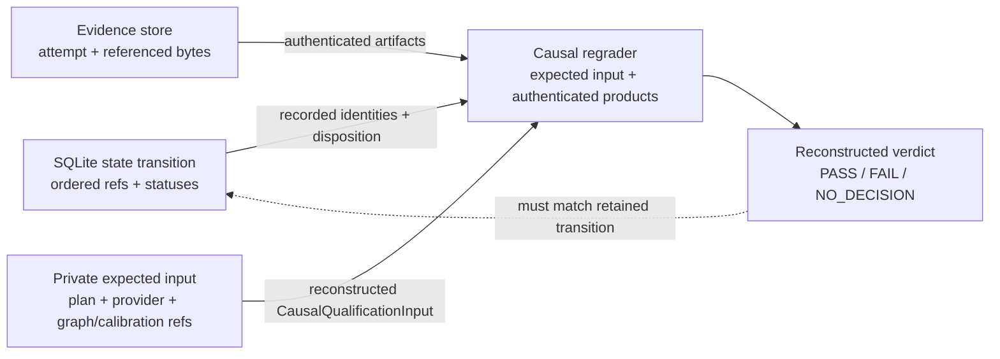

# Evidence and replay

Optima retains typed, content-addressed qualification attempts and referenced evidence. A
summary score, log excerpt, or database flag is not sufficient authority by itself. The
persisted attempt is also not a self-contained full-regrade package: causal regrade
requires the caller to supply the exact reconstructed `CausalQualificationInput`, including
private plan/provider authorities and graph/calibration references not embedded in SQLite
or `CohortQualificationAttempt`.

SQLite, the evidence store, and deployment-owned regrade context play complementary roles.
SQLite says **which transition was authorized and in what order**. The evidence store
authenticates **the attempt and referenced artifacts that were published**. The external
context supplies **the expected causal plan, requirements, and artifact references needed
by the full grader**. Backing up only the first two preserves settlement byte authority but
does not guarantee that the complete qualification decision can be regraded.

## Durable state and regrade authority

### SQLite authority

`FinalizedIntakeStore` records ordered state and references:

- chain scope, finalized cursor, and reservations;
- immutable proposal publication and copy disposition;
- arena screen attempts and receipts;
- qualification authority, outcomes, and reproduction state;
- settlement candidates, leases, events, and evaluation stacks;
- standing and discovery reward claims; and
- weight projections and publication journal records.

The database is the transactional index and state machine. Large semantic evidence bytes
belong in the separate evidence store.

### Content-addressed evidence store

Every `EvidenceArtifactRef` binds:

- domain;
- SHA-256;
- exact byte length;
- media type; and
- schema identifier.

The store requires a canonical absolute owner-only root, owner-only shard directories,
single-linked read-only files, size bounds, no symlinks, atomic publication, fsync, and a
stable digest check when reopening. Existing duplicate bytes are accepted; conflicting
bytes at the same address fail.

The default artifact limit is 64 MiB, with a hard 1 GiB ceiling. Individual evidence
producers may impose tighter bounds.

### Regrade context

`reopen_causal_qualification(..., expected=...)` requires a reconstructed
`CausalQualificationInput`. The expected object supplies the full prepared plan, candidate
authorities, graph evidence references and requirements, calibration artifact/reference
context, runtime resource policy, T/reference authority, and commitment. The persisted
`QualificationAuthorityManifest` carries identity fields and commitments, not this full
object. Production retention must therefore preserve enough reviewed private deployment
state to reconstruct the exact expected input; a digest without the typed object is not a
regrade recipe.

## Evidence chain

Authoritative qualification relates these products. The table is a conceptual authority
chain, not a claim that every row is embedded in the attempt or SQLite:

| Stage | Representative retained identity/evidence |
|---|---|
| Intake | Finalized block/event order, payload, committed hash, reservation, immutable publication |
| Stack construction | Target catalog, contribution ref, incumbent/candidate manifests, materialized trees, marginal arm/cohort plans |
| Arena | Service manifest, capacity decision, ordered screen-stage evidence and receipt |
| Launch | Runtime preflight, model mount, native build/publication, hardware/resource/seccomp identity |
| Execution | Durable v3 `ResidentSpeedWitness` with B/C/B′ and, when escalated, C′/B″ resident-read rates; physical-lane roles and richer session/device observations are validated against the frozen plan. Legacy v1/v2 attempts retain `SpeedWitness` charged-rate rows |
| Slot audit | Bounded raw eager/untimed candidate facts, exact slot × rank/process coverage, canonical decimal receipt identity, and trusted-host grade when the plan registers an audit requirement |
| Graph | Member, variant, shape, capture, and replay observations |
| Selection | Pre-execution commitment, post-commit entropy, secret reveal, selected prompts, sealed trajectory digest |
| Reference | Candidate-free T session/request/frame identities plus the referenced raw teacher/rollout/hidden-task quality artifact; raw request/response transcript bytes are not embedded in the attempt |
| Calibration | Raw control evidence, context, frozen thresholds and metric policy |
| Qualification | Regraded candidate report and complete cohort attempt |
| Reproduction | Distinct authority, attempt, report, and selection evidence over the same economic identity |
| Settlement | Paired candidate, evidence references, hash-chained event plan, atomic stack transition |
| Weights | Exact retained projection plus journal status/blocks/`last_update`/reason; live vectors are compared during reconciliation but pre/post readback vectors and post-read metagraph identity are not serialized |
| Release | Integration records, model receipt, source/wheel, native inventory, SBOM, provenance, descriptor signature, OCI attestation, serve receipts |

Not every artifact is public. Selection secrets and hidden tasks remain in private
validator storage; serializable authority records contain references and commitments, not
the secret bytes.

## Reopening and regrading

A full evidence regrade is available only when the exact expected
`CausalQualificationInput` can be reconstructed. It proceeds from identities, not from a
desired verdict:

1. Reopen the chain-scoped reservation and immutable publication.
2. Reopen the exact target catalog, stack/tree, launch, model, and native identities.
3. Authenticate each evidence artifact by domain, schema, size, and digest.
4. Validate the required three- or five-leg `ChargedExecutionRate` sequence,
   physical-lane roles, counts, and intervals, then regrade speed under frozen
   calibration.
5. Regrade graph observations against the frozen requirement.
6. When the registered plan requires slot audit, reopen the bounded raw audit
   facts, verify exact slot × rank/process coverage, and reproduce the
   Torch-free host grade.
7. Reconstruct selection and verify post-commit entropy and trajectory binding.
8. Verify T is candidate-free and covers the selected prompts/tasks.
9. Regrade quality and speed under the exact frozen calibration.
10. Reconstruct the qualification decision and reproduction identity,
    including the required physical-lane swap across a settlement pair.
11. Reopen settlement and reward claims before projecting weights.

Missing, changed, ambiguous, or context-mismatched evidence prevents a valid full regrade;
it must not be patched over with an operator assertion. The live qualification path maps
its recognized authority failures to `NO_DECISION`; a later audit must describe missing
external regrade context as an unavailable proof, not fabricate a new verdict.

Settlement recovery is narrower. It reopens and authenticates the retained attempt bytes,
checks the stored PASS disposition and seven digest-distinctness fields, and binds the
settlement transition. It does not call the full causal grader or recover graph/calibration
references from the attempt. “Reopened for settlement” and “fully regraded” are therefore
different evidence claims.

### Sampled slot audit is registered authority, not ambient authority

[`optima/audit.py`](https://github.com/latent-to/cacheon/blob/main/optima/audit.py)
emits sampled comparison facts for supported live dispatch seams. Production
qualification keeps those facts out of charged B/C/B′[/C′/B″] roles and obtains them from
a separate eager, untimed candidate role. [`optima/audit_gate.py`](https://github.com/latent-to/cacheon/blob/main/optima/audit_gate.py)
grades the bounded facts without importing Torch, requires the exact registered slot ×
TP-rank/process coverage, and rejects malformed, duplicate, or unexpected coverage.
Floating-point facts are canonicalized to decimal strings before durable receipt
identity.

This is authority only when the frozen qualification plan contains the matching typed
audit requirement. It is not a universal cross-slot gate, and a diagnostic receipt from
another runtime cannot be attached later. A plan that requires audit cannot treat a
missing or incomplete witness as either a PASS or an attributable candidate FAIL.

### Example: reopening a disputed speed pass

A reviewer starts with the settlement candidate, not with a dashboard's reported
speedup. They reopen both qualification attempt references and verify that their
reproduction identities match while the seven required authority, attempt, report,
commitment, and selection digests differ. The references may share one
content-addressed store root. For each attempt they then:

1. reopen each report's versioned speed evidence—`SpeedWitness` for legacy v1/v2
   or `ResidentSpeedWitness` for v3—verify the required fixed or adaptive
   three-or-five-read schedule, and, for v3, confirm that reproduction exchanges
   the incumbent and candidate physical-lane roles;
2. verify retained conditioning/timed/charged token counts, intervals, sums, and the witness
   projection digest;
3. recompute aggregate rates, baseline drift, escalation decision, and candidate
   speed result under the frozen calibration;
4. reopen and regrade any required eager/untimed audit witness;
5. reopen selection commitments and the sealed candidate trajectory;
6. verify the separate T lifetime is candidate-free and regrade quality;
7. reconstruct the attempt verdict; and
8. verify settlement used the lower accepted speedup and the exact live target transition.

If the dashboard rounded both attempts to “1.04×” but the retained aggregate witnesses
regrade to different accepted values, those exact values and the conservative settlement
rule govern. The persisted attempt cannot answer a dispute that requires raw batch frames,
per-arm device samples, or lifecycle receipts; logs must not be presented as if the schema
had authenticated those absent products.

## Failure semantics

| Problem discovered while reopening | Consequence |
|---|---|
| Artifact digest, length, domain, media type, or schema differs | Authentication failure; do not consume the bytes |
| Artifact exists but belongs to another arena/stack/attempt context | Context mismatch; it cannot repair this authority |
| Required attempt/witness or referenced graph/quality evidence is incomplete | No attributable regraded verdict; hold or `NO_DECISION` |
| Regraded result differs from stored verdict | Preserve both products, stop downstream transition, investigate policy/code/state integrity |
| Two passes reuse authority or evidence | Reproduction requirement is unsatisfied |
| Active claim's evidence was deleted | Hold reward projection; do not treat deletion as retirement |
| Release artifact fails reopen while crown evidence survives | Block that release/publication; historical crown authority is a separate state machine |

## Retention and recovery

The code authenticates evidence that exists; the operator owns retention policy and
disaster recovery. A production plan should define:

- evidence lifetime for active crowns, retired claims, disputes, and releases;
- SQLite-consistent backups plus evidence-store snapshots;
- restore tests that preserve file modes, ownership, single-link shape, and absolute root;
- capacity alerts and a policy for non-authoritative screen/debug logs;
- encryption and access control for private prompts, hidden tasks, model identity, and
  operational metadata; and
- deletion rules that prevent an active reward claim from outliving its reopenable
  authority.

Deleting evidence for an active crown is not harmless garbage collection: economics will
hold the projection when the claim can no longer reopen.

Retention clocks are type-specific. Settlement lease expiry can recycle a lease, and a
discovery claim may have a policy lifetime. Eligible unresolved intake rows expire
automatically against finalized arrival/progress-block authority after the configured
SLA; wall-clock age is not the authority. Active `fetching`, `screening`, and
`qualifying` work is excluded, and the dedicated schema-3 migration hold requires its
explicit archive path. An operator may also call the typed `expire` transition after the
configured minimum age or release a held reservation with an audited reason. None of
these row-level transitions is a typed retirement of an entire arena. Backup or cleanup
procedures must preserve authoritative rows and evidence until a valid transition is
retained.

### Restore drill

A useful restore test uses a copy of the SQLite database and evidence root on a clean
owner-controlled path. Test two paths separately: settlement's attempt-byte/PASS reopen,
and full causal regrade using a separately restored exact `CausalQualificationInput`.
Weight projection reopening is a third state path. Verify not only digests, but also the
filesystem assumptions enforced by the evidence store: absolute root, owner-only
directories, regular single-linked files, read-only modes, and stable size/digest during
access. A byte-perfect backup restored with unsafe ownership or hard links should fail;
an SQLite/evidence restore without the private expected input must not be reported as a
successful full regrade.

## Privacy and observability

Retain the minimum data required by the registered policy. Do not place wallet secrets,
release private keys, cloud credentials, private worklogs, or unrelated user prompts in
evidence artifacts. Logs are useful for operations but should refer to content digests
instead of dumping candidate source, hidden work, or model data.

## Nonclaims

- Content addressing proves byte integrity, not semantic correctness.
- Regrading reproduces the implemented policy; it does not prove the policy was well
  chosen.
- Weight projection evidence binds the desired vector and projection-time metagraph/state
  identities. The publication journal records status and chronology metadata, not the
  pre/post readback vectors or post-read metagraph identity; it neither authenticates those
  live observations nor turns separate SDK queries into a block-atomic snapshot.
- Sampled audit is authoritative only under the exact registered requirement and
  separate eager/untimed role; it is not ambient evidence that can be reused
  across plans or slots.
- Local retention does not provide cross-validator consensus or public availability.
- A database administrator or host root can still destroy or replace the entire authority
  domain; backups, access control, and independent audit remain operational requirements.

## Source anchors

- [Evidence store](https://github.com/latent-to/cacheon/blob/main/optima/eval/evidence_store.py)
- [Calibration evidence](https://github.com/latent-to/cacheon/blob/main/optima/eval/calibration.py)
- [Qualification evidence model](https://github.com/latent-to/cacheon/blob/main/optima/eval/qualification.py)
- [Qualification runner and regrade](https://github.com/latent-to/cacheon/blob/main/optima/eval/qualification_runner.py)
- [Torch-free audit gate](https://github.com/latent-to/cacheon/blob/main/optima/audit_gate.py)
- [SQLite authority](https://github.com/latent-to/cacheon/blob/main/optima/chain/intake.py)
