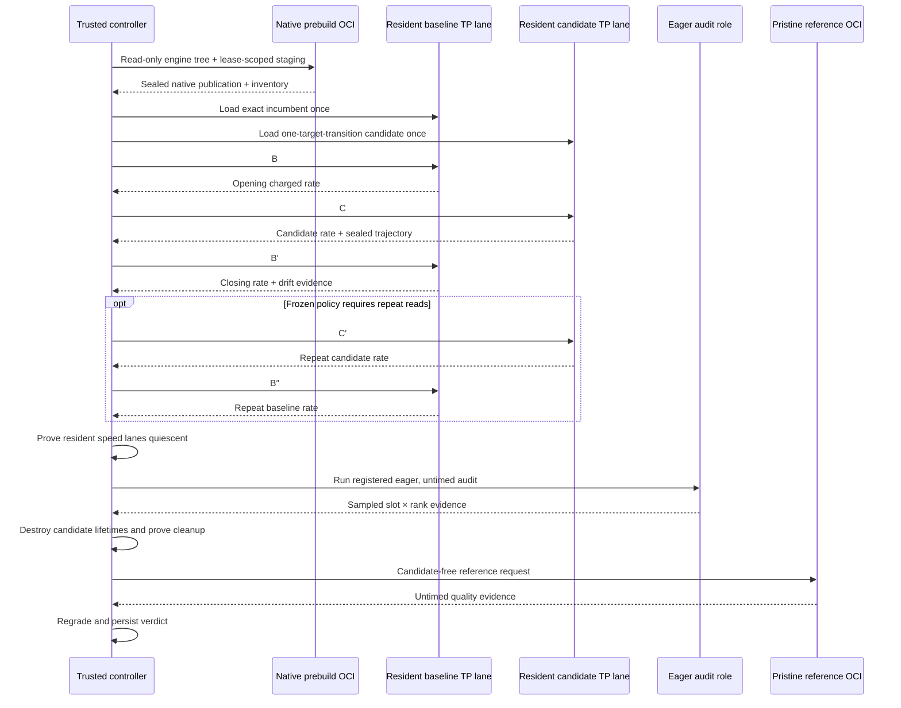

# Isolation

Production Optima treats each candidate as a complete hostile engine. The trust boundary
is the validator-owned OCI lifecycle plus the external controller—not the AST scanner,
Python subprocess, SGLang plugin, or candidate engine itself.

The containment model has two directions:

- **keep the candidate in** — no network, ambient mounts, controller imports, keys, or
  durable writable state; and
- **keep authority out of the candidate** — roles, clocks, workloads, output allocation,
  evidence acceptance, settlement, weights, and release signing remain host-owned.

A sandbox that merely prevents egress but lets the candidate choose its score would still
be an invalid referee.

## Separation by stage



There is no direct native-prebuild-to-resident-lane artifact handoff that bypasses the
host's publication, inventory, and reopen checks. There is no
resident-candidate-to-pristine-reference process reuse: candidate destruction precedes
the pristine quality lifetime.

### 1. Private intake

Hosted bytes first enter validator-owned private storage. The fetcher validates transport,
archive shape, ownership/modes, and the committed content hash. Workers never mount this
mutable private tree directly.

### 2. Deterministic materialization

The validator resolves one target-scoped delta over an exact incumbent, rewrites its
namespace, and materializes a content-addressed engine tree. Execution isolation does not
define economic identity: C is still exactly one registered target replacement even
though the worker runs a complete engine.

### 3. Native prebuild

The disposable prebuild container receives:

- a digest-pinned local image;
- the materialized engine tree, read-only;
- a reviewed seccomp profile; and
- one lease-scoped writable staging mount.

It receives no network, GPU, model, home directory, wallet, Docker socket, or ambient host
mount. The top-level prebuild parses candidate files as data and invokes only
validator-registered rebuild patchers. A registered sealed-direct-artifact patcher may
start a further bounded compiler child, import the declared candidate factory there, and
call it under the closed compile-request/profile ABI. The host never imports candidate
Python or loads the produced native object.

Prebuild container controls include:

```text
network=none        read-only root       ipc=none
cap-drop=ALL        no-new-privileges    reviewed seccomp
non-root uid/gid    CPU/memory/PID caps  private noexec /tmp
no healthcheck      no container logs    no GPU visibility
```

The native publication is inventoried, size-bounded, sealed, and reopened before runtime.

### 4. GPU runtime

The runtime container receives only:

| Mount/resource | Access |
|---|---|
| Exact sealed model tree | Read-only at `/optima/input/model` |
| Materialized engine tree | Read-only at `/optima/engine-tree` |
| Reopened native artifact publication | Read-only under `/optima/native-artifacts` |
| Lease-scoped runtime cache | Writable private tmpfs at `/optima/runtime-cache` |
| `/tmp` and shared memory | Bounded private ephemeral storage |
| GPUs | Only the physical devices bound by trusted launch identity |

Runtime controls include no network, read-only root, private IPC, dropped capabilities,
no-new-privileges, reviewed seccomp, non-root UID/GID, CPU/memory/PID/nofile/core limits,
private noexec `/tmp`, fixed shared-memory size, no healthcheck/log driver, isolated Python
flags, and offline Hugging Face/Transformers environment.

Mount roots are required to be pairwise disjoint and cannot expose the controller's
working directory, referee source, wallet, or other ambient host data.

Production speed qualification uses two isolated resident TP lanes under one frozen
authority while the controller serializes GPU work. The primary attempt fixes incumbent
and candidate physical roles; an eligible reproduction must exchange those roles. The
adaptive schedule begins with B/C/B′ and adds C′/B″ only when the registered escalation
rule requires it. Residency avoids model reloads; it does not relax mount, protocol,
device, deadline, or evidence identity.

The earlier resident **screen** is a different lifetime and authority. Its hot-swap
control directory exists only in the routing tier, admits only safely swappable bundles,
and cannot produce crown evidence. Direct AOT, dependency-patched, native-rebuild, and
setup-hook contributions bypass that screen through an explicit waiver and still receive
the full isolated qualification path.

When a qualification plan requires sampled slot audit, the candidate also runs in a
separate eager, untimed role. Its bounded facts are host-regraded and cannot be mixed into
the charged speed evidence.

### 5. Pristine reference

T uses a distinct reference session protocol. Its engine tree must contain no proposal
contributions, and its native publication is control-only. The runtime rejects candidate
artifacts or discovery activation in the reference session.

This separates quality authority from both candidate C and potentially hostile incumbent
B′.

## Host-owned execution

The outer controller owns:

- launch and role identities;
- workload batches and token budgets;
- absolute deadlines;
- session framing and bounded outputs;
- pre/active/post device-state receipts;
- timers and speed recomputation;
- physical-lane assignment and adaptive escalation;
- typed audit coverage and host regrade;
- candidate destruction before T; and
- final cleanup and quiescence proof.

Candidate code can control its own engine process. It cannot choose roles, read chain
keys, publish weights, update SQLite, or sign a release through the worker protocol.

## Durable OCI leases

Each container and local resource set has a durable lease record and exact labels. The
process manager verifies ownership before removal, performs cleanup after success or
failure, and repeats removal checks to close client/container races. Startup recovery
releases stale leases and orphan resources in the executor's own namespace.

If cleanup, unmount, device drain, or absence proof cannot be established, qualification
fails as infrastructure authority; it must not become a candidate `PASS` or `FAIL`.

### Failure behavior

| Failure | Security interpretation | Qualification behavior |
|---|---|---|
| Prebuild requests GPU/network/model or an undeclared mount | Policy violation or malformed launch | Reject before execution |
| Native output inventory changes after publication | Tampering or unstable build product | Reopen fails; runtime must not receive it |
| Candidate misses a deadline or exhausts a bound | Hostile/buggy behavior or resource pressure | Teardown under the registered attribution/retry policy; infrastructure ambiguity is `NO_DECISION` |
| Runtime emits malformed/oversized protocol data | Hostile protocol behavior | Bound/reject input and destroy the session |
| One selected collective rank fails | Peers may already be in communication | Abort the complete candidate engine; never rank-local fallback |
| T receives a candidate contribution/native publication | Broken pristine-reference authority | Reject T and return no valid quality decision |
| Container disappears before ownership/cleanup proof | Lifecycle race or external interference | `NO_DECISION`; recover leases and inspect the host |
| GPU remains busy or reset cannot be proven | Possible residue or driver failure | Drain/isolate device or host before reuse |

## Static scanning and Python subprocesses

Source scanning remains useful defense in depth. It applies the Python AST policy to every
declared and vendored `.py` file. Manifest-declared CUDA sources and dependency patches are
recognized as separate reviewed-build tiers; they are not Python-AST scanned. The tree
guard rejects undeclared executable files, binary artifacts, and symlinks. None of these
checks proves arbitrary code safe, especially generated native code.

The scanner admits the required CuTe DSL form `cute.compile(...)` only
when the receiver is bound exactly once by a plain absolute alias of the
allowlisted external `cutlass.cute` module and the first positional argument is
not a string/bytes literal. Rebinding, shadowing, a second import, or a
contribution-local `cutlass` namespace withdraws the admission; `builtins`
imports remain banned so `builtins.compile` cannot bypass the dynamic-code
rule. The stdlib-only `DSL_JIT_ENTRYPOINTS` table is the validator-owned source
of truth. This is a narrow tracing-language carve-out, not a general compile
permission.

Runtime process role is a separate boundary. Import hooks may arm pass-through
adapters in several SGLang children, but candidate modules load only at the
wrapped scheduler-process entry. Detokenizer/output-path and other manager
children never import candidate code or write an `active` receipt; exact
active-member coverage must equal the expected scheduler rank count.

Component verification uses fresh spawned workers so the CLI process does not import
normal candidate entry code. Developer model launches may load candidate code in model
workers and may add a diagnostic no-egress namespace. Those properties do not substitute
for the production OCI, mount, device, evidence, and cleanup authority.

## Serving releases are a different boundary

The reviewed release container is not a candidate evaluator. After signature,
provenance, model, native, and engine-tree verification, the serving host intentionally
creates it with host network and host IPC for serving. Do not copy those settings into
candidate qualification.

## Operator requirements

- Pin OCI images by digest and verify the local runtime preflight.
- Keep Docker/container-runtime control and the host root account out of candidate reach.
- Use dedicated evaluator hosts or an isolation domain suitable for hostile GPU code.
- Patch the host kernel, container runtime, GPU driver, and firmware.
- Monitor stale leases, device-drain failures, OOMs, timeouts, and host resets.
- Keep model, evidence, database, and wallet roots disjoint with enforced ownership.
- Treat seccomp and resource policy changes as reviewed identity changes.

## Incident-response checklist

When a candidate run violates containment or leaves ambiguous residue:

1. Stop scheduling new work on the affected lease, GPUs, and host isolation domain.
2. Preserve host-owned launch identity, bounded protocol frames, device receipts, lease
   records, runtime inspection, and teardown errors. Candidate logs are supplementary.
3. Mark the attempt as infrastructure-invalid/`NO_DECISION` unless complete authority
   proves a candidate-attributable policy failure.
4. Reconcile exact lease labels and resources; do not broadly delete unrelated containers
   to make absence checks pass.
5. Drain/reset devices or the host as required, then prove quiescence before reuse.
6. Rotate any credential that operational misconfiguration may have exposed, even if the
   candidate protocol contains no credential path by design.
7. Treat changes to image, seccomp, mounts, device policy, or controller code as new
   identity and calibration inputs; do not retry under the old authority label.

## Limits

OCI containment is not a formal security proof. GPU code exercises a large kernel/driver
attack surface; device memory isolation, firmware, DMA/IOMMU configuration, container
runtime, and host administration remain trusted. A severe GPU hang may require resetting
the device or host. Co-tenancy and side-channel policy are deployment decisions outside
the repository.

See [Threat model](threat-model.md) and [Evidence and replay](evidence.md).

## Source anchors

- [Engine launch identities](https://github.com/latent-to/cacheon/blob/main/optima/eval/engine_launch.py)
- [OCI prebuild](https://github.com/latent-to/cacheon/blob/main/optima/eval/oci_prebuild.py)
- [OCI process leases](https://github.com/latent-to/cacheon/blob/main/optima/eval/oci_process.py)
- [OCI runtime backend](https://github.com/latent-to/cacheon/blob/main/optima/eval/oci_backend.py)
- [Reference session](https://github.com/latent-to/cacheon/blob/main/optima/eval/oci_reference_session.py)
- [Scheduler-only candidate load gate](https://github.com/latent-to/cacheon/blob/main/optima/integrations/sglang_scheduler_gate.py)
