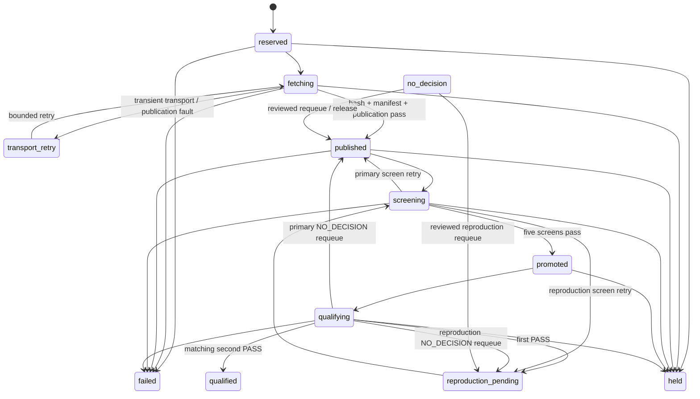

# The finalized chain loop

The production loop is a non-emitting, restart-safe intake and qualification
controller. It does **not** accept a shell evaluator, keep a JSON scoring ledger, or
submit weights after each pass.

## One pass

`run_pass(...)` performs these operations in order:

1. **Bind chain scope.** Open the SQLite store against the chain genesis hash and
   netuid. A database created for another scope is not reused.
2. **Read finalized history.** Continue after the durable cursor and reconstruct exact
   reveal priority from finalized storage and canonical event positions.
3. **Reserve before transport.** Persist every arrival in chain order before any fetch.
   Slow hosting therefore cannot rewrite priority.
4. **Fetch privately.** Accept HTTPS only, validate DNS and every redirect, enforce
   archive limits, extract regular files safely, and rederive the committed hash.
5. **Classify and fingerprint.** Parse a normal target-scoped proposal or the distinct
   discovery schema. Parser success—not a miner-selected mode switch—chooses the lane.
   Copy identity covers the submitted delta, never the validator's incumbent stack.
6. **Publish immutably.** Copy the validated private tree to a content-addressed worker
   publication and reopen it before use.
7. **Reconcile copies.** Compare durable fingerprints in finalized order. This step is
   separate and idempotent so a crash between publication and copy disposition cannot
   bypass priority.
8. **Screen and qualify.** If a registered arena service was injected, run its staged
   screens, use the routing-only resident lane where applicable, form a
   capacity-bounded cohort, execute authoritative resident qualification, and persist
   outcomes.
9. **Settle retained pairs.** Lease economically unblocked, independently reproduced
   candidates and apply the resulting settlement plan transactionally.

The pass returns counts and dispositions. It never opens a wallet or calls
`set_weights`.

## Reservation state machine

The row status is an operational control signal, not merely a progress label:



`qualified` means two matching PASS qualifications have been retained. The associated
settlement candidate then has its own transactional state (`pending`, `leased`, and a
terminal economic disposition such as `crowned`, `held`, `neutralized`, or
`discovery_bounty`). A reservation can remain `qualified` while settlement decides its
economic outcome; do not infer a crown from the reservation status alone.

Several terminal paths are omitted from the diagram for readability: an operator may
explicitly expire sufficiently old inactive work, copy reconciliation can turn a later
submission into `failed`, and bounded retry exhaustion leads to `held`.

## Public CLI: intake only

The supported standalone command is:

```bash
optima chain-validate \
  --netuid 307 \
  --network "wss://test.chain.opentensor.ai:443" \
  --intake-db chain_intake/intake.sqlite3 \
  --private-root chain_intake/private \
  --publication-root chain_intake/worker \
  --intake-only \
  --once
```

Remove `--once` to run continuously; `--interval` controls the delay between passes.

`chain-validate` accepts only its declared intake and arena schema. Chain-signing
credentials, external evaluator commands, scoring policy, and weight publication belong
to separate authorities and must not be added to the validator-loop service.

Without `--intake-only`, the CLI rejects startup unless its Python caller injects an
exact `ArenaServiceRegistry` and selects a registered `--arena-id`:

```python
from optima.chain.validator_loop import run_validator

run_validator(
    subtensor,
    netuid,
    intake_db="chain_intake/intake.sqlite3",
    private_root="chain_intake/private",
    publication_root="chain_intake/worker",
    arena_registry=registry,   # constructed by reviewed deployment code
    arena_id="production-arena-id",
    intake_only=False,
)
```

This is an integration boundary, not a copy-paste complete deployment: the repository
does not provide the production provider represented by `registry`.

In daemon mode, `run_validator` contains pass-level validator faults. It logs the full
exception, increases the sleep multiplier up to six times the configured interval, and
resets the failure count after a successful pass. The Python API default stops after ten
consecutive failures so a supervisor can intervene. Candidate dispositions already
committed before the process-level exception remain in SQLite; the loop does not roll
the entire pass back as one transaction.

## HTTPS intake boundary

The on-chain payload is a canonical JSON object containing schema version, lowercase
SHA-256 content hash, and an HTTPS URL. It is limited to 1024 UTF-8 bytes.

Production fetch enforces:

- HTTPS and TLS 1.2 or newer;
- globally routable resolved addresses;
- connection to a reviewed address while retaining TLS SNI and hostname checks;
- validation of every redirect, with at most five redirects;
- 64 MiB downloaded archive, 256 MiB extracted content, and 4096 members;
- 16 MiB per regular file, 8 MiB per inspectable source file, and 32 MiB aggregate
  inspectable content;
- raw gzip/tar preflight before `tarfile` materializes metadata, including 64 KiB per
  PAX/GNU extension header and 1 MiB aggregate extension payload;
- no symlinks, hardlinks, special files, duplicate/path-conflicting members, or path
  traversal; and
- a bounded transfer deadline.

`file://` exists only behind explicit test helpers. It is not accepted by
`chain-submit`, payload decoding, or the production fetch function. Plain HTTP is not
accepted at all.

## Private and worker storage

The fetch root is validator-owned private storage. The code requires owner-private
directories and files and never mounts this mutable intake tree directly into a worker.

Publication creates a separate carrier:

- all bytes are proven to participate in the committed identity;
- files are sealed read-only and directories are non-writable;
- the destination address is content-derived; and
- reopening independently rederives the publication and content hash.

Treat both roots as operational data, not as interchangeable caches.

## Durable reservation states

The store makes work and failure class explicit:

| Class | States |
|---|---|
| Active | `reserved`, `fetching`, `transport_retry`, `published`, `screening`, `promoted`, `qualifying`, `reproduction_pending` |
| Terminal | `failed`, `expired`, `qualified` |
| Operator/retry disposition | `held`, `no_decision` |

Default intake policy bounds include queue size, per-hotkey and per-target admission,
transport and qualification retries, cohort size, epoch cutoff, and expiry. These are
code defaults, not a promise that they suit every deployment; an operator should review
them alongside arena capacity.

The default `IntakePolicy` values are:

| Bound | Default | Effect |
|---|---:|---|
| Epoch / cutoff | 360 / 30 blocks | Arrivals in the cutoff tail are admitted into the next epoch |
| Pending queue | 256 | New valid arrivals beyond the bound fail admission deterministically |
| Per hotkey / epoch | 16 | Limits one submitter's intake occupancy |
| Per target / epoch | 64 | Applied after the target is resolved from submitted bytes |
| Transport / qualification attempts | 3 / 3 | Exhaustion produces a retained hold rather than infinite work |
| Controller cohort | 8 | Bounds fetch, screening, and qualification selection per pass |
| Finalized-block expiry SLA | 2,880 blocks | Automatically expires eligible unresolved rows and sets the minimum age for explicit expiry |

Arena capacity is an additional bound. Its queue age/depth, active-screen,
active-qualification, cohort, and retry limits are content-bound in the service manifest.
Changing either policy changes operational behavior and should be reviewed and recorded;
the code defaults are not calibrated economics.

The controller applies the finalized-block SLA on every pass, including retained-only
passes, and inside intake and settlement transactions that depend on unresolved priority.
Eligible `reserved`, `transport_retry`, `published`, `promoted`,
`reproduction_pending`, `held`, and `no_decision` rows expire automatically when their
arrival or retained-progress block reaches the bound. In-flight `fetching`, `screening`,
and `qualifying` rows are not aged out underneath active work. A first retained PASS
records a fresh finalized progress block and starts a full bounded reproduction window
from that block. Legacy retained evidence with an unknown progress block, including the
dedicated schema-3 migration hold, remains fail closed for explicit operator disposition.
This prevents slow reproduction from losing its complete SLA while preventing one old
PASS from becoming a permanent priority veto.

Discovery proposal identity is checked before screening. A proposal already retained as
seen or awarded is terminally disposed, and legacy pending duplicates are deduplicated
before lease. Repackaging cannot buy another screen or bounty.

## Verdict and retry semantics

The controller maps failures according to where authority was lost:

| Point of failure | Stored disposition | Retry behavior |
|---|---|---|
| Invalid chain payload, unsafe archive, content-hash mismatch, malformed proposal | `failed` / `FAIL` | None; attributable intake failure |
| Transient HTTPS/DNS or immutable-publication storage fault | `transport_retry` / `NO_DECISION` | Retry until the transport budget, then `held` |
| Static/build/ABI/graph/serving screen `FAIL` | `failed` / `FAIL` | None under that screen authority |
| Screen timeout or inconclusive evidence | Retry in the same primary or reproduction lane | Arena screen budget decides retry versus hold |
| Qualification plan/runner/raw-speed failure affecting a registered cohort | `NO_DECISION` for every member plus a persisted bisection plan | Cohort halves are retried to isolate poisoning without assigning losses |
| Per-candidate post-attempt `NO_DECISION` | Retained report plus one-candidate requeue | Retry in primary or reproduction lane |
| First complete `PASS` | `reproduction_pending`; no settlement candidate yet | Fresh screen and qualification required |
| Second matching complete `PASS` | `qualified`; paired candidate becomes settlement-pending | Settlement leases it when earlier economic blockers clear |

The qualification retry counter counts retained qualification dispositions. The screen
counter counts retained screen attempts. Restarting the service does not reset either.
Likewise, changing a reason string or moving files does not create a fresh economic
identity.

## Restart behavior

On restart, the store does not pretend interrupted work completed:

- interrupted fetch or qualification becomes `held` with `NO_DECISION`;
- an interrupted screen returns to the appropriate retry lane; and
- an expired settlement lease returns to pending with a new generation.

The finalized cursor, reservation identities, and immutable publications make repeated
passes idempotent. Validator/storage faults should produce retry or hold, not a miner
loss. A supervisor can restart the loop, but must not delete or hand-edit the database to
“unstick” it.

Recovery is intentionally conservative:

- `fetching` and `qualifying` become `held` with `NO_DECISION`, because the controller
  cannot prove what completed outside the transaction;
- `screening` returns to `published` or `reproduction_pending` with a retry disposition,
  preserving which lane was interrupted; and
- a `leased` settlement candidate returns to `pending`, clears its lease, and increments
  the generation so a stale worker cannot commit it later.

A hold is not self-healing. Diagnose the retained `reason`, repair the authority, and use
the reviewed release/requeue API appropriate to the deployment. The store's
`release_hold(...)` appends an operator reason and chooses the lane from retained
publication and reproduction evidence; it does not erase prior attempts. No public CLI
wraps reservation-hold release, so deployment tooling must expose it under its
own access controls and audit trail.

### Archive an exact schema-3 migration hold

One legacy database shape can retain a single-PASS schema-3 candidate that cannot satisfy
the current two-PASS parser. It has a dedicated terminal operation:

```bash
optima chain-archive-schema3-hold \
  --netuid <NETUID> \
  --network <NETWORK_OR_WSS_URL> \
  --intake-db chain_intake/intake.sqlite3 \
  --reservation-id <RESERVATION_ID> \
  --reason "reviewed migration reason"
```

The command constructs no wallet. It accepts only the exact migration hold, records the
current finalized height and bounded operator reason, preserves candidate and
qualification bytes, removes the permanent queue veto, and can never release or crown
the evidence. Generic expiry and hold release are not substitutes.

## Incident playbook

| Alert | Immediate containment | Safe recovery criterion |
|---|---|---|
| Finalized cursor regression or changed hash | Stop the controller; preserve DB and endpoint logs | Chain endpoint/finality authority is understood; never overwrite the cursor |
| “another intake controller owns this database” | Find the legitimate owner; do not remove `.lock` | Exactly one live controller/signer window owns the DB |
| Repeated transport retry | Preserve URL, DNS, TLS, redirect, and archive evidence | Same committed bytes can be fetched within policy, or work remains held |
| Publication fault | Stop worker consumption of the affected address | Storage ownership/modes and independent reopen pass |
| Growing queue age | Stop new operational expansion; inspect screen/qualification capacity | Registered capacity and hardware can drain finalized order without reordering |
| Cohort-wide `NO_DECISION` | Preserve failure digest and retry groups | Bisection or infrastructure repair completes under the same frozen authority |
| Evidence root unavailable | Block settlement and weights | Exact referenced artifacts reopen; rebuilding “equivalent” JSON is insufficient |
| Repeated pass exceptions | Let the bounded loop exit and quarantine the host if needed | Root cause fixed; one `--once` pass succeeds before daemon restart |

## Operations checklist

- Put the database, private root, and publication root on durable local storage.
- Back up the database using a SQLite-aware procedure; copying only the main file while
  WAL writes are active is not a valid backup.
- Alert on growing `held`, `no_decision`, transport retry, and queue-age counts.
- Monitor disk and inode use in both private and immutable publication roots.
- Run `optima chain-compat` after changing the Bittensor SDK.
- Keep coldkeys off this host. Intake needs no wallet; the separate weight signer uses
  only the configured validator hotkey.
- Coordinate signer access between passes because the SQLite authority is single-owner.
- Retain service manifest, policy, logs, screen receipts, qualification artifacts, and
  software/image digests long enough to explain every standing claim.

Continue with [Arena service](arena-service.md) and
[Settlement and weights](settlement-and-weights.md).

## Source anchors

- [Finalized reveal reader](https://github.com/latent-to/cacheon/blob/main/optima/chain/__init__.py)
- [Payload schema](https://github.com/latent-to/cacheon/blob/main/optima/chain/payload.py)
- [HTTPS fetcher](https://github.com/latent-to/cacheon/blob/main/optima/chain/fetch.py)
- [Finalized intake store](https://github.com/latent-to/cacheon/blob/main/optima/chain/intake.py)
- [Immutable publication](https://github.com/latent-to/cacheon/blob/main/optima/chain/publication.py)
- [Validator loop](https://github.com/latent-to/cacheon/blob/main/optima/chain/validator_loop.py)
- [Archive-bound tests](https://github.com/latent-to/cacheon/blob/main/tests/test_chain_fetch.py)
