# Validator and operator guide

Optima has two operational planes with different trust boundaries:

- the **referee plane** accepts proposals, measures marginal improvements, retains
  evidence, settles target ownership, and projects rewards; and
- the **release plane** defines how reviewed contributions become signed,
  chain-independent Optima Engine artifacts.

A validator may operate both planes, but they must not be collapsed. A crowned miner
bundle is still hostile proposal material. It is not a production release, and the
serving fleet never needs chain access or a miner-hosted URL.

!!! important
    The public `optima chain-validate` command can run finalized **intake only**. Full
    screening and qualification require deployment code to inject a trusted
    `ArenaServiceRegistry` and select `--arena-id`. This repository defines the typed
    interface and enforcement logic; it does not ship a production arena provider.

## Deployment topology

The production design is a set of authorities, not one privileged daemon. A practical
deployment has at least four independently supervised roles:

```mermaid
flowchart LR
    Chain["Finalized chain history"] --> Intake["Intake controller<br/>no wallet"]
    Origin["Miner HTTPS origin"] --> Intake
    Intake --> Private["Private 0700 fetch tree"]
    Private --> Publication["Immutable worker publication"]
    Publication --> Screen["Resident screen<br/>routing only"]
    Screen --> Arena["Injected arena service<br/>trusted provider"]
    Arena --> OCI["Resident TP lanes<br/>serialized B/C/B′/(C′/B″)"]
    OCI --> Audit["Audit-only role"]
    Audit --> T["Pristine T reference<br/>candidate-free"]
    T --> Evidence["Content-addressed evidence"]
    Evidence --> Store["Single-writer SQLite authority"]
    Store --> Signer["Weight reconciler<br/>hotkey only"]
    Signer --> Chain
    Store -. "reviewed crown input" .-> Integration["Integration and release authority"]
    Integration --> Registry["Signed engine release / registry"]
    Registry --> Serving["Production serving fleet<br/>no chain access"]
```

The boxes imply operational boundaries:

- **Intake host:** reads finalized chain state and untrusted HTTPS, owns the private
  tree and SQLite scope, but needs no wallet.
- **Arena control plane:** owns the registered service manifest, provider implementation,
  capacity policy, selection secrets, and qualification construction. Candidate metadata
  cannot select any of them.
- **Execution fleet:** receives immutable, content-addressed inputs and runs hostile
  engines under the OCI controller. It receives neither wallet material nor release keys.
- **Signer:** opens the same durable authority only for a coordinated reconciliation
  window, refreshes live metagraph state, and uses the validator hotkey. The store's
  nonblocking process lock prevents concurrent controllers from silently sharing it.
- **Release and serving plane:** starts only from reviewed integrated source. It does not
  mount proposal publications, evidence roots, the intake database, or chain credentials.

They can be colocated for development, but colocation does not merge their authority.
For example, putting the signer on the intake host does not permit `chain-validate` to
open the wallet, and putting a release builder beside the worker fleet does not make a
crown deployable.

## Production flow

The current validator path is deliberately staged:

1. Read every newly finalized reveal in canonical chain-event order.
2. Reserve that order durably in a single-writer SQLite store.
3. Fetch the committed archive over HTTPS, enforce transport and extraction limits,
   and rederive the committed content hash.
4. Resolve the submitted delta to one registered target, or to the separate discovery
   lane, and compute copy fingerprints over submitted bytes only.
5. Copy the private intake tree into an immutable worker publication.
6. Run registered, non-crownable screens, using the routing-only resident screen for
   swappable candidates and an explicit waiver for non-swappable candidates.
7. Qualify promoted candidates under adaptive v3 resident crossover: serialized B/C/B′,
   optional C′/B″ for borderline evidence, then audit and pristine T.
8. Require an independent reproduction of the same candidate identity with the exact
   physical TP-lane role swap.
9. Apply target and evaluation-stack changes in one settlement transaction.
10. Reconcile the global reward projection from a separate signer process.

Discovery policy includes a `registered_promotion` disposition and typed
`DiscoveryWinRecord`/`DiscoveryPromotion` objects. The durable composition store does
not yet transport and reopen that promotion authority, so registered promotion fails
closed. The implemented durable discovery disposition is `bounty_only`; a later
registered target still requires its own admitted qualification and reproduction.

One reservation therefore crosses three different kinds of state:

| Phase | Durable state or product | Who may advance it |
|---|---|---|
| Arrival | Finalized cursor and `reserved` row | Intake controller |
| Transport | `fetching` → `transport_retry`, `failed`, or `published` | Intake controller |
| Screening | `screening` → `promoted`, retry lane, `failed`, or `held` | Registered arena service through the controller |
| Qualification | `qualifying` → `reproduction_pending`, `qualified`, `failed`, or `no_decision` | Qualification authority plus transactional store projection |
| Settlement | Leased candidate, event journal, stack generation, active claims | Pure planner plus SQLite transaction |
| Emissions | V1 standing or V2 finite-debt projection and append-only publication journal | Separate weight reconciler |
| Shipping | Integration record and signed release | Release authority, never the settlement loop |

`FAIL` and `NO_DECISION` are intentionally different. `FAIL` is an attributable terminal
candidate disposition under a frozen rule. `NO_DECISION` means the validator lacks fair,
complete authority and may retry or hold the work. Operators must preserve that distinction
in alerts, dashboards, and manual procedures.

Read [The chain loop](chain-loop.md), [Arena service](arena-service.md),
[Qualification](qualification.md), and
[Settlement and weights](settlement-and-weights.md) in that order.

## Authorities that must stay separate

| Authority | Owns | Must not trust |
|---|---|---|
| Chain intake controller | Finalized order, reservations, private fetch, publication, durable state | Network arrival order, miner paths, mutable hosted bytes |
| Arena service | Runtime/model/topology/workload identity, capacity, screens, qualification-plan construction | Submission-provided module paths or commands |
| OCI execution controller | Resident lane roles, serialized work, mounts, deadlines, device observations, protocol, teardown | Candidate process, candidate clocks, candidate quality claims |
| Audit-only role | Exact slot × rank/PID witness graded by the trusted host | Candidate-side audit or framework output |
| Pristine reference T | Untimed teacher-forced quality evidence | Candidate C or incumbent B′ as grading oracle |
| Settlement store | Paired reproductions, target transitions, reward claims | A single passing report or stale incumbent identity |
| Weight signer | Wallet, live metagraph, publication journal, chain readback | An SDK “submitted” return value as confirmation |
| Release authority | Integration review, model seal, release key, deterministic artifacts | A crown as automatic permission to ship |

## Operator surfaces

| Task | Supported surface |
|---|---|
| Inspect slot and SDK compatibility | `optima slots`, `optima compat`, `optima chain-compat` |
| Package and submit a proposal | `optima chain-package`, `optima chain-submit` |
| Inspect chain state | `optima chain-status` |
| Run bounded finalized public intake | `optima chain-validate --intake-only` |
| Run full referee service | Deployment code calling `run_validator(...)` with an injected registry/provider |
| Reconcile legacy V1 rewards | `optima set-weights`, optionally `--watch`, in a separate control-plane process |
| Project an all-uncrowned V1 bootstrap | `optima set-weights --burn-hotkey <REGISTERED_HOTKEY>` |
| Inspect V2 activation authority | `optima chain-incentive-shadow`, `optima chain-incentive-composition-shadow` |
| Activate V2 locally | `optima chain-activate-incentives` after independent approval |
| Publish confirmed V2 debt | `optima set-debt-weights` after activation |
| Seal model bytes | `optima model-provision` |
| Verify a signed release | `optima release-verify` |
| Materialize a release build context | `optima release-context` |
| Construct, sign, publish, or start a release | Reviewed programmatic APIs; no public construction CLI is bundled |

`scan` and `verify` are contributor diagnostics. Contributor-controlled matched A/B
profiling is useful before submission and during integration, but its output is not a
crown, a settlement record, or weight authority. See
[Contributor profiling](running-evals.md).

## Durable state

Production referee state lives in `FinalizedIntakeStore`. The store binds its database to
a chain genesis hash and netuid, records finalized
priority, and carries each reservation through fetch, screening, qualification,
reproduction, settlement, and weight-publication state. WAL mode, full synchronous
writes, a process lock, and explicit restart recovery make partially completed work
visible rather than silently replaying it.

The SQLite database is also the join point between intake, settlement, and weight
publication. It is not a generic shared database service: one `FinalizedIntakeStore`
owner holds an exclusive filesystem lock while open. Schedule signer runs between
validator passes or stop the controller cleanly for reconciliation; do not add a second
writer, copy a live WAL database into place, or remove the lock file to force access.

Immutable publications and evidence roots are durable dependencies of standing state.
Deleting them after a crown can make later settlement reopening, reward projection, or
integration review fail closed. Treat retention, backup, and restore as part of consensus
operations, not log rotation.

## Failure ownership

Use the authority boundary to decide who absorbs a failure:

| Failure | Economic treatment | Operator action |
|---|---|---|
| Invalid payload, committed-hash mismatch, unsafe archive, attributable screen/qualification violation | Candidate `FAIL` | Retain reason/evidence; no automatic retry |
| DNS/TLS timeout, publication storage fault, controller crash, excessive baseline drift, missing evidence authority | `NO_DECISION`, retry, or `held` | Repair validator infrastructure, then use the bounded retry/release path |
| Queue or cohort capacity exceeded | Queue while within policy; otherwise `held` | Add capacity or review the registered bounds; never reorder by fetch completion |
| Settlement incumbent or journal head changed | Abort/hold; no partial transaction | Reopen current authority and re-plan |
| Weight readback missing or divergent | Publication `held` | Preserve journal, audit chain state, append an explicit release only after review |
| Release verification or serve receipt failure | No rollout | Quarantine artifact/image; do not fall back silently to stock serving |

Developer-local state and profiler output do not describe production economics and cannot
replace any durable intake, qualification, settlement, or weight-publication product.

## What the implementation does not claim

- It does not provide a turnkey production arena provider or fleet scheduler.
- It does not make direct diagnostic execution safe for crownable work.
- It does not make a single validator's measurement globally trustworthy; validator
  consensus and deployment policy remain external system concerns.
- It does not eliminate workload overfitting, GPU/driver vulnerabilities, denial of
  service, or release-key operational risk.
- It does not automatically ship a crowned proposal.
- It does not treat resident-screen measurements as crown authority.
- It does not provide a retained live V2 activation or debt-publication receipt.
- It does not implement durable registered discovery promotion.
- It does not claim a completed production Engine release, authorized registry image,
  or complete all-rank serving receipt set for this revision.

Security assumptions and residual risks are detailed in
[Threat model](../security/threat-model.md) and [Isolation](../security/isolation.md).

## Source anchors

- [Product model](../architecture/product-model.md)
- [Finalized validator loop](https://github.com/latent-to/cacheon/blob/main/optima/chain/validator_loop.py)
- [SQLite intake authority](https://github.com/latent-to/cacheon/blob/main/optima/chain/intake.py)
- [Arena service contract](https://github.com/latent-to/cacheon/blob/main/optima/arena_service.py)
- [Settlement planner](https://github.com/latent-to/cacheon/blob/main/optima/settlement.py)
- [Release implementation](https://github.com/latent-to/cacheon/blob/main/optima/release.py)
