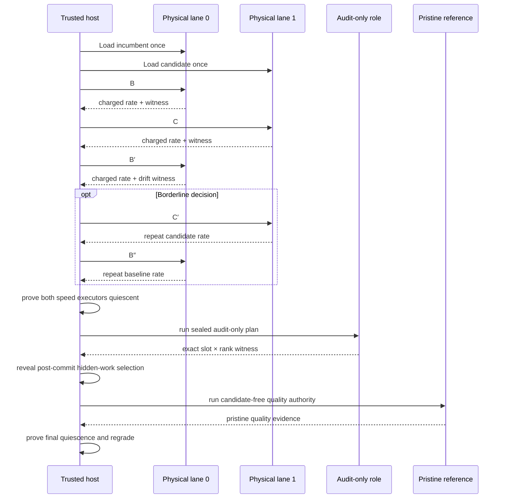

# Authoritative qualification

Qualification asks a narrow question: does one exact submitted delta improve one frozen
evaluation stack, in one registered arena, at acceptable quality?

The production answer comes from an adaptive resident crossover protocol executed by a
trusted host controller. Two isolated physical TP lanes keep the incumbent and candidate
resident while timed GPU work remains serialized. It does not come from a routing screen,
local diagnostic launch, candidate-side self-audit, miner report, or arbitrary evaluator
command.

## Identities before execution

Before a candidate runs, the validator binds:

- finalized reservation and hotkey;
- arena service and workload;
- target catalog and exact singleton or atomic target;
- submitted-delta digest;
- incumbent and candidate `EvaluationStackManifest` digests;
- materialized engine-tree and launch identities;
- model, runtime, topology, native build, seccomp, and worker distribution;
- calibration, resident speed, physical-lane, slot-audit, and graph-verification
  requirements; and
- selection commitment, private selection secret reference, and candidate order.

For a registered candidate, C is the incumbent stack with exactly one target replaced.
Every other contribution, adapter, fallback, and engine setting is supplied by the
validator. Discovery uses its separate prepared overlay identity and cannot install an
evaluation-stack manifest merely by passing.

There are three nested identities to keep straight:

| Identity | What it fixes | Why it matters |
|---|---|---|
| Reservation | Finalized arrival, hotkey, publication, target members, submitted delta | Prevents a later file tree or miner from inheriting the attempt |
| Qualification authority | Frozen source/plan, candidate order, selection commitment, arena/calibration/runtime identities | Prevents the evaluator from changing the experiment after admission |
| Reproduction identity | Arena, target, delta, hotkey, and exact incumbent/candidate stack and tree digests | Defines what the second independent PASS must reproduce |

Paths are not identities. Moving the same publication or evidence store does not change
the content digests, while rebuilding “equivalent” source under new bytes does.

## Speed-policy versions

Retained attempts identify the speed policy that created them:

| Version | Timed reads | Purpose |
|---|---|---|
| v1 | B/C/B′ | Historical byte-compatible authority |
| v2 | B/C/B′/C′/B″ | Fixed repeat-read authority |
| v3 | B/C/B′, then C′/B″ only when borderline | Resident adaptive production authority |

The legacy constructor default remains v1 so historical serialized evidence reopens
without reinterpretation. A production arena provider must explicitly bind v3 resident
authority. Merely changing the policy label does not upgrade old evidence.

## Resident adaptive timeline

The v3 plan binds two non-overlapping physical TP lanes, equivalent topology, separate
runtime namespaces, lane-specific NUMA policy, exact workload, and a total qualification
budget. Both engine lifetimes remain resident, but the controller permits only one lane
to execute GPU work at a time.

The cheap B/C/B′ sequence decides clear wins, clear losses, and excessive-noise cases.
Only a policy-defined borderline result authorizes C′/B″. The candidate cannot request
extra reads. The retained witness records which reads occurred, lane identities,
operational timing, and the stage and total budgets.

Speed is graded before the expensive audit and pristine-reference stages. An ordinary
speed non-PASS emits a durable stage-exit and does not run audit or T. A separately bound
calibration-observation disposition may continue after a speed failure to collect
diagnostic audit and T evidence, but it cannot crown the candidate.

The audit-only role is distinct from both timed lanes. Trusted-host grading imports no
PyTorch and requires the expected slot × TP-rank/PID coverage, minimum call counts, and
absence of retained violations or protocol errors. Live floating-point facts are
canonicalized into stable decimal strings before they enter the durable witness.

T remains untimed and candidate-free. The host owns role assignment, monotonic clocks,
token numerators, conditioning windows, absolute deadlines, device observations, audit
grading, selection entropy, and teardown. Candidate wall-clock reports and aggregate
throughput are ignored.

## Cohorts and selection

A service may freeze one incumbent and qualify a chain-ordered cohort `C1..Ck`, sharing
bookends and one pristine reference lifetime where the policy permits. This is an
operational optimization, not a semantic relaxation:

- every C remains one exact marginal delta;
- candidate ordering is sealed in finalized cohort/plan order before entropy is observed;
- post-commit entropy selects the hidden prompt/task work, and the selection receipt binds
  that choice without reordering candidates;
- drift outside calibration produces `NO_DECISION`; and
- retained evidence must still support each candidate independently.

The contract does not require cold model loads for every timed read. It requires resident
lane identity, serialized execution, read order, audit authority, and pristine-reference
authority to remain causally and cryptographically separable.

For registered cohorts, a recognized cohort-level factory, runner, raw-speed,
outer-session, or OCI-backend failure that the intake boundary normalizes into a
qualification failure product produces `NO_DECISION` for every affected reservation and a
persisted bisection plan. Subsequent passes halve the cohort to isolate a poisoning or
resource-sensitive candidate in logarithmic retry groups. A per-candidate `NO_DECISION`
after a complete shared attempt is requeued individually. Other provider, controller, or
evidence-publication exceptions abort the pass and recover through controller
restart/hold handling rather than this typed batch product. Neither mechanism changes
finalized arrival order.

A typed candidate-worker error is attributable only when it binds the exact candidate
arm and identity. The controller can contain that candidate and continue producing
durable outcomes for unaffected cohort members. Baseline-lane, shared-controller,
audit/T, or untyped worker failures are infrastructure authority failures; they are never
assigned to a convenient candidate.

## Gates and three-way decisions

Qualification reopens and grades several evidence products:

1. **Execution:** required roles completed under the expected launch and device state.
2. **Graph verification:** required target members, variants, shapes, capture, and replay
   have complete evidence.
3. **Speed:** C, and C′ when required, beat the calibrated baseline bracket and
   noise-derived bar.
4. **Audit:** the sealed audit-only plan has complete exact slot × rank authority.
5. **Quality:** pristine T validates sealed trajectories and hidden work under the
   registered calibration.
6. **Whole-stack identity:** the report still describes the frozen incumbent and exact
   candidate stack.

The result is one of:

- `PASS` — all required evidence is complete and green;
- `FAIL` — attributable candidate evidence violates a registered requirement; or
- `NO_DECISION` — infrastructure, drift, missing authority, or incomplete evidence makes
  a fair result impossible.

`NO_DECISION` is retryable under bounded policy. It is not a loss and must not be
converted to zero reward for convenience.

The evidence-to-verdict mapping is fail closed:

| Observation | Decision | Example |
|---|---|---|
| Complete, bound, and green across every required product | `PASS` | C clears calibrated speed bar; graph and pristine quality pass |
| Complete attributable violation of a frozen candidate requirement | `FAIL` | Wrong output, graph replay failure, or measured quality regression |
| Authority incomplete, stale, unreopenable, too noisy, timed out, or infrastructurally invalid | `NO_DECISION` | Missing evidence bytes, baseline drift, controller/worker failure |

An unexpected exception is not evidence of candidate guilt. The intake projection turns
recognized plan, runner, and raw-speed authority failures into typed failure products and
retry plans. Other controller exceptions are contained by the pass loop and recovered
conservatively on restart.

## Independent reproduction

One passing qualification is persisted as `reproduction_pending`. Settlement requires a
second passing qualification that matches:

- arena, target, selected delta, and hotkey;
- incumbent and candidate stack/tree identities; and
- reproduction identity.

It must differ in qualification authority, attempt evidence, report, and selection
evidence. Reusing the first attempt under a new filename is rejected. Settlement uses the
lower of the two measured speedups.

For resident v3 evidence, the reproduction must also use the exact physical-lane role
swap: the primary candidate lane becomes the reproduction baseline lane, and the primary
baseline lane becomes the reproduction candidate lane. The resident speed policy and
settlement control digest remain equal. Using fresh process labels on the same orientation
is not an independent resident reproduction.

More precisely, the pair must keep the contribution identity equal while all seven
independence fields differ:

| Must match | Must differ |
|---|---|
| Lane, arena, reservation and finalized order | Qualification authority digest |
| Hotkey, target, members, selected delta | Qualification plan digest |
| Arm and incumbent/candidate stack + tree digests | Attempt artifact digest |
| Incumbent and candidate manifests (registered lane) | Qualification report digest |
| Discovery proposal identity (discovery lane) | Selection commitment digest |
|  | Selection-secret commitment digest |
|  | Selection evidence digest |

Registered resident qualifications additionally match the audit-control digest and use
distinct audit seed/evidence while binding the exact swapped physical-lane orientation.

“Independent” in this state-machine contract means those seven digest distinctions. The
schema does not attest that the attempts used different operators, hosts, organizations,
or infrastructure failure domains; a deployment that requires those properties must bind
and audit them separately.

After the first PASS, the same reservation goes through the five non-crown screens again
in the reproduction lane. Only the second PASS creates a `SettlementCandidate`. Before
settlement, the store requires exactly two retained qualification rows, reopens both
attempt references from their recorded store roots, confirms both dispositions still
carry PASS authority, and binds a new
settlement-evidence receipt. The slower passing speedup is used even if the primary was
faster.

## Reopen and regrade

Full regrade requires more than the persisted attempt reference. The caller must
reconstruct the exact `CausalQualificationInput`, including prepared plans, candidate
authorities, graph/calibration references and requirements, runtime policy, reference
authority, and commitment. SQLite's authority manifest and
`CohortQualificationAttempt` bind identities but do not embed that complete private
provider/plan object. Settlement restart authenticates attempt bytes and stored PASS
dispositions; it does not invoke the full causal regrader.

The final report is derived from the serialized attempt, referenced graph/quality
artifacts, and calibration manifests. Reopen can regrade graph and raw quality evidence.
Speed regrading uses the retained witness type registered by the speed-policy
version. Legacy v1/v2 use `SpeedWitness`: v1 contains three aggregate B/C/B′
`ChargedExecutionRate` rows and v2 contains a fixed five B/C/B′/C′/B″ rows. V3
requires `ResidentSpeedWitness`, which retains the actual adaptive
three-or-five-read schedule, resident physical-lane authority, operational timings,
and budget. Regrading recomputes rates and the frozen decision from those typed
facts; it does not reconstruct them from raw session frames. A summary JSON line
without these products is not authority.

See [Evidence and replay](../security/evidence.md) for retention and audit requirements.

An authoritative attempt is not one headline. Durable authority includes the authority
manifest; selected plan and commitment/entropy/selection receipts; referenced graph or
discovery-execution evidence; the aggregate speed witness; the pristine-T execution
witness and raw quality artifact/binding; per-candidate reports; and the enclosing attempt
artifact. Settlement keeps references to both attempt roots.

The live outer session validates richer per-read protocol frames, lifecycle order, device
state, and cleanup before constructing that attempt. Those raw frames and per-arm device
samples are not serialized into `CohortQualificationAttempt`. The aggregate speed witness
must not be documented as raw batch retention or as proof that a later audit can replay the
original timing frames.

Reopening verifies hashes and expected bindings before grading. If the attempt artifact
reopens but a referenced graph, calibration, or raw quality product does not, authority is
still incomplete. Operators must retain every referenced evidence-store object and test
restores, not merely archive the final report digest. If policy requires raw B/C/B′ frame
replay, the attempt schema must first be extended to retain and bind those products.

## Qualification incident handling

| Incident | Required disposition |
|---|---|
| Candidate engine exceeds deadline or violates protocol with attributable evidence | Grade under the frozen requirement; `FAIL` only when attribution is complete |
| Typed worker failure binds one exact candidate arm | Contain that candidate; retain its attributable outcome and preserve unaffected cohort results |
| Recognized worker, Docker, GPU, driver, plan, runner, or raw-speed authority failure | `NO_DECISION`; repair infrastructure and use bounded retry |
| Evidence-store publication failure | Abort the pass; recovery holds an interrupted `qualifying` row as `controller_restart_during_qualifying` rather than manufacturing a typed `NO_DECISION` |
| Baseline drift exceeds calibration | `NO_DECISION`; do not increase the candidate's denominator or tune the bar after seeing C |
| Either resident speed executor survives past its quiescence proof | Abort authority; never launch audit or T into the contaminated lifetime |
| Audit role misses a slot/rank, reports a violation, or cannot reopen | `FAIL` only for a complete attributable violation; otherwise `NO_DECISION`; never substitute candidate-side audit output |
| T identity/session mismatch | `NO_DECISION`; T cannot be replaced with B′ or a candidate-side audit |
| One member poisons a registered cohort | Preserve cohort failure digest and execute the stored bisection groups |
| First PASS evidence root lost | No reproduction or settlement; restore exact bytes or hold |
| Reproduction differs in contribution identity or reuses any independence digest | Reject the pair; it is not an independent reproduction |

Never rerun only the favorable arm, splice evidence from different authorities, or lower
a threshold after seeing the outcome. A fresh attempt must be a complete, newly bound
qualification under the registered policy.

## Nonclaims

- Passing proves the registered arena/workload and policy, not universal model quality or
  performance.
- T is an independent semantic reference, not proof that the reference implementation is
  bug-free.
- Isolation and protocol checks reduce candidate influence; they are not a formal proof
  against GPU, driver, kernel, or container-runtime compromise.
- A crown records measurement and attribution. It does not satisfy integration, license,
  provenance, maintainability, or release review.
- Deployment must supply a reviewed production provider that constructs this work for the
  registered arena. Structural two-PASS fixtures can test the authority path but cannot
  establish an empirical GPU crown or production calibration.

Next: [Settlement and weights](settlement-and-weights.md).

## Source anchors

- [Qualification evidence model](https://github.com/latent-to/cacheon/blob/main/optima/eval/qualification.py)
- [Causal qualification runner](https://github.com/latent-to/cacheon/blob/main/optima/eval/qualification_runner.py)
- [Resident crossover runtime](https://github.com/latent-to/cacheon/blob/main/optima/eval/crossover_runtime.py)
- [Torch-free audit gate](https://github.com/latent-to/cacheon/blob/main/optima/audit_gate.py)
- [Finalized-intake projection](https://github.com/latent-to/cacheon/blob/main/optima/eval/qualification_intake.py)
- [Pristine reference session](https://github.com/latent-to/cacheon/blob/main/optima/eval/oci_reference_session.py)
- [Qualification tests](https://github.com/latent-to/cacheon/blob/main/tests/test_qualification_runner.py)
