# Reviewed engine releases

A crown and a production release are deliberately different objects.

- A **crown** records independently reproduced marginal improvement in the hostile
  evaluation stack.
- An **integrated contribution** preserves the exact crowned selected payload inside
  reviewed Optima-owned packaging and an immutable integration record.
- An **engine release** contains only integrated contributions, exact model/runtime/native
  identities, and signed chain-independent artifacts.

The serving fleet consumes the last object. It never loads live miner bundles or depends
on chain availability.

```mermaid
flowchart LR
    Crown["Two-PASS CROWN<br/>hostile proposal identity"] --> Review["Integration review<br/>exact selected payload + reviewed packaging"]
    Review --> Integrated["IntegratedContributionRef"]
    Integrated --> Manifest["Integrated-only EngineReleaseManifest"]
    Manifest --> Prepared["Prepared release<br/>model/native/runtime/SBOM/provenance"]
    Prepared --> Signed["Ed25519-signed published tree"]
    Signed --> Context["Verified deterministic build context"]
    Context --> Images["Two no-cache/no-network builds<br/>matching registry digest"]
    Images --> Authorized["Authorized image + descriptor + key + platform"]
    Authorized --> Serve["Fail-closed serving container<br/>required seam receipts"]
```



Every arrow is an explicit authority transition. None is automatic, and none may be
reconstructed from a human-readable release note alone.

!!! danger "Use the canonical acceptance gate"
    The programmatic APIs expose release-construction and host-verification primitives;
    they do not imply that the pinned implementation is deployable. Production acceptance
    requires the complete [publication checklist](../engine/release-workflow.md#publication-checklist),
    including clean-wheel closure, provider-specific native proof, effective serving-policy
    closure, builder-output binding, and descriptor/session-bound receipts. Consult the
    dated [State of record](../reference/state-of-record.md) before operating this sequence.

## Integration gate

Before a crown enters `EngineReleaseManifest`, review must establish at least:

- reproduction against both the crowned evaluation stack and current release stack;
- byte-for-byte preservation of the crowned selected payload, with maintainable
  Optima-owned packaging and tests around that closed payload;
- correctness, security, and fallback behavior;
- license and provenance acceptability;
- compatibility with other active integrated contributions and the pinned SGLang
  revision; and
- immutable contributor attribution and release notes.

The release manifest accepts `IntegratedContributionRef` values only. A hostile
`ProposalContributionRef` cannot be serialized into it as a shortcut.

The programmatic promotion path reopens the active crown and both qualification attempts,
requires the exact CROWN event and candidate, reopens license/provenance/security/
compatibility/test artifacts, inspects the integrated tree, rederives the crowned selected
payload digest, and proves that the full reviewed Git commit contains those exact source
bytes. The resulting review record
includes its own digest in the `IntegratedContributionRef`; release validation requires
byte-equality with that record.

This preserves two facts simultaneously: the selected payload remains byte-for-byte the
crowned delta identity, while packaging and maintainability work outside that selected
closure—and later validator-owned materialization namespaces—can be reviewed and
normalized. “We rewrote the same idea” is not sufficient if the selected payload digest
changes.

## Seal the model tree

Model provisioning hashes every file in the exact model directory, publishes a
content-addressed receipt, and reopens the tree:

```bash
optima model-provision \
  /models/example-model \
  /srv/optima/model-publications \
  --workers 4
```

Both arguments must already be concrete directories, and the receipt publication
directory must be outside the model tree. Provisioning rejects symlinks, hardlinked model
files, special files, unstable metadata/content, and case-colliding portable paths rather
than hashing through them.

Use `--expected-content-digest` when an external review already fixed the intended model
bytes. The command prints the content digest, receipt digest, and receipt path.

## Release descriptor

`EngineReleaseDescriptor` binds:

- integrated-only release manifest and materialized engine-tree digest;
- deterministic Optima runtime source and wheel;
- model provision receipt;
- reviewed seccomp profile;
- pristine reference and calibration manifests;
- SPDX SBOM and in-toto provenance;
- pinned upstream repository, revision, and SGLang version;
- exact native build/publication inventory;
- integration review records; and
- `ServeSpec` with digest-pinned base image, OCI platform, model mount, TP size, and
  restricted engine arguments/environment.

The runtime distribution is `optima-engine` version `0.0.1`. Its deterministic
artifacts are:

```text
optima-engine-source-0.0.1.tar.gz
optima_engine-0.0.1-py3-none-any.whl
```

Release construction builds those artifacts twice and rejects disagreement.

That is deterministic source/wheel construction inside `prepare_release`; it is distinct
from the later host operation that builds and pushes the complete OCI context twice. A
green source/wheel comparison does not claim that two container builds or a serve smoke
have run.

## Published tree

A signed release has exactly these top-level entries:

```text
release-root/
├── artifacts/
├── engine-tree/
├── native-artifacts/
├── release.json
└── release.sig.json
```

The artifact directory includes `model-provision.json`, `seccomp.json`,
`reference-manifest.json`, `calibration-manifest.json`, `sbom.spdx.json`, and
`provenance.intoto.json` in addition to the source and wheel.

The descriptor is signed with Ed25519. Verification requires the operator's expected
32-byte public key; trusting the key embedded in the signature envelope would not
authenticate the release authority.

## Verify a release

```bash
optima release-verify /srv/optima/releases/<release> \
  --expected-public-key <64_HEX_PUBLIC_KEY> \
  --descriptor-digest <EXPECTED_DESCRIPTOR_SHA256>
```

`--descriptor-digest` is optional at the parser level, but pin it in deployment when an
external rollout decision names a specific release. Verification reopens the signature,
descriptor, artifacts, engine tree, native inventory, model receipt, SBOM, provenance,
seccomp, integration records, and file modes.

## Materialize a deterministic build context

```bash
optima release-context \
  /srv/optima/releases/<release> \
  /srv/optima/build-contexts/<release> \
  --expected-public-key <64_HEX_PUBLIC_KEY> \
  --descriptor-digest <EXPECTED_DESCRIPTOR_SHA256>
```

The context contains the verified release, trusted public key, reviewed seccomp bytes,
deployment metadata, and Dockerfile. No chain state, wallet, signing key, or miner URL
enters it.

## Registry and serving host

After the canonical acceptance gates are supplied, the reviewed programmatic host
primitives participate in a workflow that must:

1. build and push the context twice with no cache and no build network;
2. require identical registry manifest digests;
3. sign a reproducibility attestation;
4. authorize the exact registry image, release descriptor, platform, and public key;
5. pull and create a digest-pinned serving container with read-only root, tmpfs, seccomp,
   no-new-privileges, dropped capabilities, read-only model mount, and reviewed labels;
6. verify policy again before start; and
7. require descriptor/session-bound active, routed, and completed receipts for every
   released slot and rank, with no load-failure or fallback receipts, plus per-rank AOT
   load/invocation coverage for sealed direct artifacts.

The generic functions do not themselves provide all of these end-to-end authorities.
In particular, a matching registry readback must be authenticated against each builder's
emitted output, and the generic serve-receipt verifier does not bind receipt frames to a
release/session or enforce AOT receipt coverage.

Serving uses host network and host IPC intentionally because this is a reviewed product
container, not an untrusted candidate evaluator. The release runtime verifies the signed
release, model, seccomp state, command, environment, native publication, and engine tree
before executing SGLang in a fresh interpreter.

## Release operating sequence

Use this sequence only after the canonical checklist and state ledger show that every gate
exists. Require a two-person or otherwise independently reviewed release procedure:

1. **Freeze inputs.** Pin the active crown, integration record set, engine tree, model
   receipt, native publication, upstream revision, SGLang version, base-image digest,
   platform, seccomp bytes, reference/calibration manifests, and `ServeSpec`.
2. **Prepare twice-derived evidence.** Run programmatic release preparation and verify
   source/wheel reproducibility, clean-wheel import/entrypoint closure,
   SBOM/provenance closure, integrated-only manifest, provider-specific native
   profile/index/ABI proof, native tree binding, and model receipt.
3. **Sign offline or in an isolated release authority.** Publish the canonical descriptor
   and signature. Distribute the expected public key and descriptor digest through a
   separate trusted channel; never learn trust from `release.sig.json` itself.
4. **Verify on the build host.** Run `release-verify`, then `release-context` into a new,
   empty destination. Do not reuse a mutable prior context.
5. **Build and publish twice.** The reviewed host API performs two no-cache builds with no
   build network and requires one registry manifest digest. Separately authenticate that
   each admitted registry object came from its corresponding builder output before
   producing signed reproducibility authority.
6. **Authorize the exact container.** Bind registry repository/digest, local image
   inspection, release descriptor, external key, platform, labels, model bind, seccomp,
   device request, effective command/environment, loader/network policy, and authenticated
   management routes.
7. **Create, verify, then start.** The container is created with the reviewed restrictions;
   host policy is checked again before start. Startup must fail closed when release-required
   seam activation cannot be proven.
8. **Gate rollout on receipts.** Require release/session-bound active, routed, and completed
   receipts for every released slot and expected rank, with no load failure or fallback
   receipt. For sealed direct artifacts, also require bound per-rank AOT load and invocation
   coverage. Retain the exact image, authorization, launch, and receipt products.

Use canary/percentage rollout and ordinary service health controls in addition to these
integrity checks. Optima's release receipts do not replace latency, capacity, availability,
rollback, or customer-impact monitoring.

## Rollback and incident handling

Rollback means routing to a previously verified signed release whose image and model are
still authorized. It does not mean starting stock SGLang inside a failed release container
or loading the last crowned proposal directly.

| Incident | Containment | Recovery requirement |
|---|---|---|
| Signature/public-key or descriptor mismatch | Quarantine release tree and context | Obtain expected key/digest from independent rollout authority; never trust embedded key |
| Model receipt/content mismatch | Do not mount or start | Re-provision exact reviewed bytes or choose another signed release |
| Source/wheel or image double-build mismatch | Stop publication | Investigate nondeterminism/toolchain; create a new reviewed release if inputs change |
| Registry label/digest or local inspect mismatch | Remove image from rollout | Pull exact authorized digest and re-verify all host bindings |
| Seccomp, command, environment, platform, or device-policy mismatch | Refuse container creation/start | Correct deployment to the signed `ServeSpec`; do not weaken checks ad hoc |
| Missing seam/rank receipt, load failure, or fallback receipt | Mark smoke/rollout failed | Fix integration and cut a new reviewed release when bytes change |
| Release key suspected compromised | Stop new rollouts under the key | Rotate external trust anchor and re-sign/re-authorize through reviewed procedure |
| Runtime health regression after valid startup | Route back to a prior verified release | Preserve SLO evidence; integrity success does not block operational rollback |

Keep release keys off validator, weight-signer, evaluator, and serving hosts. The
double-build API signs its container-reproducibility attestation, so the release/publish
workflow must provide signing authority at that step. Isolate and audit that narrowly
scoped key use rather than leaving the private key resident on a general-purpose build
worker.

## Public-surface limitations

The public CLI provides commands to provision a model, verify an
existing signed release, and create its build context. It does **not** provide a public
CLI to:

- promote an exact crowned payload into reviewed integration packaging;
- construct or sign a release;
- push a registry image;
- sign its reproducibility attestation; or
- create/start a serving container.

Those are reviewed programmatic APIs and deployment responsibilities. Documentation must
not imply that `release-context` publishes or deploys anything.

## Nonclaims

- A valid signature proves origin and integrity under the expected key, not that the
  review process was correct or the key remained uncompromised.
- Reproducible source/wheel/image digests do not make the upstream toolchain or base image
  vulnerability-free.
- A successful serve smoke proves required seam receipts for that run, not production
  SLOs or universal workload performance.
- Release verification is chain-independent and does not re-adjudicate the crown.
- Evaluation OCI support for `OPTIMA_REBUILD_PHASE=load` does not close the serving
  release path. Provider-closure packaging and the CuTe compile-profile binding remain
  separate incomplete release gates.

!!! warning "Production validation gate"
    Unit and slice tests do not authorize a release. Production validation requires clean
    wheel installation, provider-specific native reopening, two builder-authenticated
    no-cache OCI outputs with matching registry identity, closed effective serving policy,
    serving at the approved topology, and bound receipt verification for the exact signed
    release/session. Structural crown fixtures can exercise release plumbing but cannot
    supply empirical qualification or production calibration. Consult
    [State of record](../reference/state-of-record.md) before claiming that any operational
    gate has been completed.

## Source anchors

- [Stack and integration manifests](https://github.com/latent-to/cacheon/blob/main/optima/stack_manifest.py)
- [Model provisioning](https://github.com/latent-to/cacheon/blob/main/optima/model_provision.py)
- [Release format and verification](https://github.com/latent-to/cacheon/blob/main/optima/release.py)
- [Fail-closed release runtime](https://github.com/latent-to/cacheon/blob/main/optima/release_runtime.py)
- [Registry and serving host](https://github.com/latent-to/cacheon/blob/main/optima/release_host.py)
