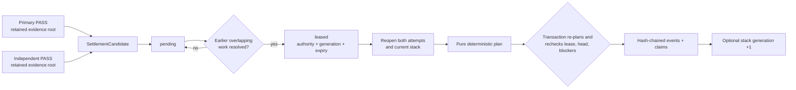
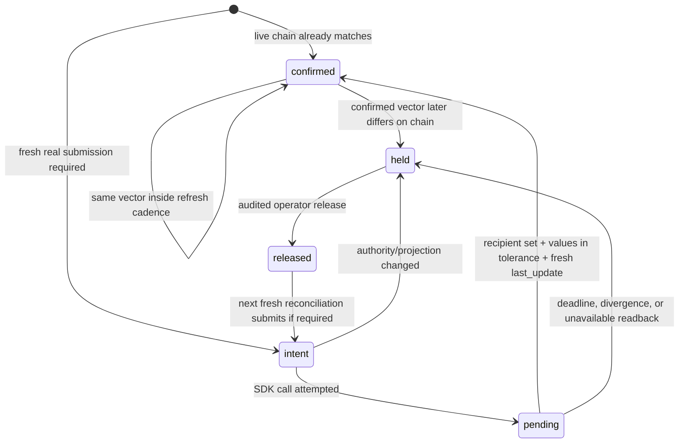

# Settlement and weights

Settlement changes the evaluation incumbent. Weight publication projects settled reward
claims onto the live metagraph. They are separate operations with separate authority.

`chain-validate` may perform settlement when a trusted arena service is injected, but it
never opens a wallet or calls a chain weight API. Legacy V1 uses `optima set-weights`;
activated finite-debt V2 uses `optima set-debt-weights`.

The separation prevents a long-running evaluator from becoming a signer and prevents a
chain SDK return value from mutating evaluation-stack authority. Both operations use the
same exclusive SQLite store at different times, so deployment must coordinate ownership:
finish or pause a validator pass, run the signer reconciliation, close the store, and
resume. A lock collision is a control-plane scheduling error, not a reason to remove the
lock file.

## Settlement inputs

`SettlementCandidate` requires two complete passing qualifications:

- a primary attempt; and
- an independent reproduction of the same arena, target, delta, hotkey, incumbent, and
  challenger identity.

The attempts must use distinct qualification authority and evidence. The candidate's
settlement speedup is the lower of the two measured speedups.

Each resident v3 attempt runs resident B/C/B′, conditional C′/B″, registered
eager audit A, then pristine T. For reproduction, the baseline and candidate
physical TP-lane orientations must exact-swap. The speed-policy and
settlement-control digests remain equal; fresh process names on the same lane
orientation do not satisfy independence.

Settlement planning is pure: it receives typed candidates plus the exact current
`EvaluationStackManifest` and tree digest. It reads no database, chain, wallet, or mutable
host state.

## From two PASSes to one atomic commit



The store chooses the oldest economically unblocked group sharing one qualification
authority. Earlier unresolved reservations that overlap the candidate's target members
remain blockers; a later fast result cannot jump them. The default lease is 30 blocks.
Expiry returns it to pending with a higher lease generation, preventing a worker holding
the old lease from committing.

The controller reads a fresh finalized height immediately before requesting each lease
and refuses a regressed clock. It refreshes the height again immediately before commit.
Inside the transaction the store verifies that the lease has not expired, the incumbent
stack and event-journal head have not advanced, economic blockers have not changed, both
retained evidence products are still byte-identical, and the plan exactly equals a
freshly recomputed plan. Any disagreement aborts the transaction. A pass with no pending
settlement work does not make these extra finalized-height reads.

Lease expiry is not arena retirement. Intake reservations have explicit `release_hold`
and minimum-age `expire` transitions. Eligible unresolved rows also expire automatically
against the finalized arrival/progress-block SLA; active in-flight work and the dedicated
schema-3 migration hold are excluded. This row-level expiry is not a generic wall-clock
TTL or a typed transition that retires an entire arena. Before a valid explicit or
automatic disposition, held state can block later overlapping work; deleting rows is not
a recovery mechanism.

## Deterministic plan

Candidates naming an older incumbent are held as `stale_incumbent`. Discovery candidates
produce bounty events without changing the stack. Among current registered candidates,
the planner chooses the highest conservative speedup and uses finalized order as a stable
tie-break.

The hash-chained event journal can contain:

| Event | Meaning |
|---|---|
| `HOLD` | Candidate cannot advance against this incumbent or lost a conflict |
| `CROWN` | Passing marginal contribution is recognized |
| `RETIREMENT` | Previous contribution at the target is superseded |
| `NEUTRALIZATION` | An overlapping target is displaced by explicit catalog policy |
| `ADOPTION` | New contribution is inserted into the evaluation stack |
| `STACK_TRANSITION` | Incumbent stack/tree advances atomically |
| `DISCOVERY_BOUNTY` | Qualified discovery receives bounded bounty treatment only |

The SQLite store leases an economically unblocked cohort, reopens the exact evidence and
current stack, and applies the event journal, stack transition, candidate dispositions,
standing claims, and discovery claims in one transaction. A failed transaction does not
partially crown a candidate.

The event journal is append-only and digest chained. Event types have distinct jobs:

- `CROWN` recognizes the winning measured contribution and creates the active standing
  claim for its registered target.
- `RETIREMENT` deactivates the previous claim for the same target.
- `NEUTRALIZATION` deactivates explicitly overlapping target families according to the
  catalog, not manifest order.
- `ADOPTION` and `STACK_TRANSITION` record the exact new evaluation manifest/tree and
  advance its generation together.
- `HOLD` records stale rows and every current registered non-winner without mutating the
  stack: stale-incumbent rows use `stale_incumbent`, overlapping losers use
  `conflict_lost`, and non-overlapping current losers use `incumbent_advanced` because the
  winning transition advanced the shared incumbent.
- `DISCOVERY_BOUNTY` creates only the bounded discovery claim; it has no stack transition.

Do not infer event meaning from a miner bundle name or the final row status. Reopen the
event, candidate pair, evidence receipt, and resulting stack state as one authority.

## Legacy V1 standing reward families

Every active registered target defines one family. A singleton target owns its slot; an
atomic target owns its complete member set and suppresses explicitly overlapping
singleton families while active.

Credit comes from marginal improvement accepted by a two-PASS pair satisfying
the seven digest-distinctness checks. The exact conversion to integer policy
units and the standing-decay equation are defined in
[Legacy V1](../reference/emissions-policy.md#legacy-v1).

Retired or neutralized contributions receive no standing credit. Engine-stack
packaging, integration, and release do not create additional reward families.
Settlement initializes the standing claim's `crowned_block` from the proposal's
finalized submission block, not from settlement time, so delayed qualification
does not reset reward age. Discovery claims use the same finalized submission
block as `awarded_block` for their bounded lifetime.

## Legacy V1 discovery bounties

Discovery does not install an evaluation stack entry. A qualifying discovery may create
one non-renewable claim with a bounded lifetime. All live discovery claims share a policy
pool measured in ppm; standing families receive the remaining pool. Repackaging,
promotion, integration, or release cannot renew the same bounty.

## Legacy V1 global projection

The reward builder reopens every active arena stack and every required standing claim,
then binds:

- chain genesis scope and netuid;
- validator hotkey;
- policy digest;
- effective block and block hash;
- current metagraph membership;
- arena stack generations and evidence; and
- an exact, positive integer-ppm vector satisfying the normative
  [Legacy V1](../reference/emissions-policy.md#legacy-v1) total.

If an active family is stale, incompatible, missing, unreopenable, or assigned to a
hotkey absent from the metagraph, the complete projection is held. Its share is never
silently redistributed.

Projection starts from an exact finalized metagraph context. Immediately before signing,
the reconciler refreshes finalized authority. A later finalized height is acceptable only
when the validator UID and every weighted recipient UID remain unchanged. Reassignment
before signing aborts publication; reassignment after submission prevents confirmation
and retains a hold. The journal still represents several finalized reads rather than an
atomic substrate transaction, so confirmation depends on the retained chronology and
exact vector readback.

Projection is global across every retained crowned arena, not “one `set-weights` call per
target.” Generation-zero staging arenas do not enter the reward projection, and an active
claim naming one fails closed. The builder requires catalog coverage for every crowned
evaluation stack, reopens the evidence behind every active standing and discovery claim,
binds the emissions-policy digest on first successful construction, and refuses a later
policy change against the same authority. Numeric policy arguments are required
operator/validator-set configuration; they are not hidden defaults or empirically
calibrated by the code.

## Dry run

Use the same policy values intended for the deployment:

```bash
optima set-weights \
  --intake-db chain_intake/intake.sqlite3 \
  --netuid <NETUID> \
  --network <NETWORK_OR_WSS_URL> \
  --wallet default \
  --hotkey validator \
  --half-life-blocks <BLOCKS> \
  --discovery-lifetime-blocks <BLOCKS> \
  --discovery-pool-ppm <PPM> \
  --refresh-blocks <BLOCKS> \
  --dry-run
```

Dry run refreshes the live metagraph and exercises projection/reconciliation, but it does
not pass a wallet to the reconciler, sign or submit an extrinsic, or create a publication
journal intent. A normal real submission requires at least one genuine current-schema
crown; the explicit all-uncrowned burn projection below is the only bootstrap exception.

### All-uncrowned burn projection

Normal projection deliberately refuses to invent a reward owner while nothing is
crowned. An operator can explicitly route the complete bootstrap vector to one registered
burn hotkey:

```bash
optima set-weights <POLICY_AND_SIGNER_ARGUMENTS> \
  --burn-hotkey <REGISTERED_BURN_HOTKEY> \
  --dry-run
```

This projection is valid only with no active standing/discovery claims, no crowned arena,
and no activated V2 composition. The burn hotkey must belong to the exact finalized
metagraph. Any real economic authority disables the path.

## Publication journal

Real publication is fail-closed and journaled:

| State | Meaning |
|---|---|
| `intent` | Exact projection persisted before the SDK call |
| `pending` | Submission attempted, but authoritative chain confirmation is absent |
| `confirmed` | The exact recipient set, normalized values within the fixed verifier tolerance, and a sufficiently new `last_update` were read back |
| `held` | Authority changed, deadline expired, readback diverged, or post-submit state is unavailable |
| `released` | Operator appended an audited release of a retained hold |

The chain helper checks the SDK response's `success` field (or the older tuple form), so
a call may return without raising and still report `submitted=False`. Even
`submitted=True` is not confirmation. The reconciler refreshes the metagraph immediately,
maps recipients to current UIDs, reads current validator weights, persists intent before
signing, and confirms only when the chain has the exact recipient set, each normalized
value is within the fixed `2e-5` relative/absolute verifier tolerance, and `last_update`
is new enough.

The normal state transitions are:



`pending` is a valid unresolved result, not success. Before its retry block, another run
only observes it. At or after the deadline, absent matching readback becomes `held` rather
than blindly resubmitting.

On every non-dry public invocation, `set-weights` first constructs the current projection,
then reopens the exact retained projection named by an `intent` or `pending` journal head.
It resumes that immutable vector across later chain heads when chain scope, netuid, and
signer authority still match; a restart cannot replace an in-flight vector merely because
a newly computed head would produce different weights. An authority mismatch fails
closed. A direct caller that bypasses this resume step and presents a different projection
to the low-level reconciler receives a retained hold rather than a silent replacement.

The reconciler can record a preexisting chain match as `confirmed` without submitting.
Conversely, it refuses a real submission when `crown_count` is zero, when the wallet
hotkey differs from the projection authority, or when the effective metagraph/block is
already stale.

If the journal is held, investigate and preserve the record. To append an audited release
without submitting:

```bash
optima set-weights \
  --intake-db chain_intake/intake.sqlite3 \
  --netuid <NETUID> \
  --network <NETWORK_OR_WSS_URL> \
  --wallet default \
  --hotkey validator \
  --half-life-blocks <BLOCKS> \
  --discovery-lifetime-blocks <BLOCKS> \
  --discovery-pool-ppm <PPM> \
  --refresh-blocks <BLOCKS> \
  --release-hold "reviewed reason"
```

Then run the normal command again so it refreshes all live authority. `--release-hold`
cannot be combined with `--dry-run`.

Releasing a hold does not approve the old vector or submit it. It appends a `released`
record with the operator reason. The next normal invocation rebuilds and refreshes all
authority before deciding whether a new intent is valid.

### Continuous V1 reconciliation

The signer can own a continuous control-plane loop:

```bash
optima set-weights <POLICY_AND_SIGNER_ARGUMENTS> \
  --watch \
  --interval <SECONDS>
```

Each iteration refreshes complete authority. The loop retries bounded retryable
transport/chain failures and stops on nonretryable publication faults. Watch mode rejects
`--dry-run`, `--reconcile-only`, and `--release-hold`; signer-free inspection remains a
deliberate one-shot operation.

## Finite-debt V2

V2 is an explicit one-way activation, not a reinterpretation of legacy claims. Before
activation, operators can run the signer-free core and composition shadows:

```bash
optima chain-incentive-shadow <CORE_ARGUMENTS>
optima chain-incentive-composition-shadow <COMPOSITION_ARGUMENTS>
```

`chain-activate-incentives` constructs no wallet. It atomically reopens the exact core
and composition policies, independent approval, finalized cursor, retained arena/stack,
target catalog, complete campaign/family roster, finalized membership and reserve, and
audit-control/canary/risk authority. It rejects non-quiescent intake, incompatible V1
publication state, or any digest mismatch.

After activation, `set-debt-weights` processes the earliest gapless policy boundary. It
binds the economic projection to the signer vector, journals submission, grades exact
finalized readback, waits for intake-cursor catch-up, and only then debits claims. A
restart, SDK success response, dry run, or projection build never reduces debt.

Registered-CROWN and reviewed-discovery debt are separate classes. The durable reviewed
path supports bounded `bounty_only`; `registered_promotion` remains fail closed until its
typed cross-lane authority can be transported and reopened.

See the [emissions policy](../reference/emissions-policy.md) for formulas, campaign
constraints, activation invariants, and current evidence limits.

## Failure and recovery matrix

| Condition | Safe outcome | Recovery |
|---|---|---|
| Earlier overlapping reservation unresolved | Candidate remains settlement-pending | Resolve earlier finalized work; do not reorder or delete it |
| Candidate names old incumbent | `HOLD` event / stale-incumbent disposition | A fresh qualification must target the current stack |
| Lease expires or store/journal head advances | Commit aborts; expired lease returns pending | Reopen authority and obtain a new lease generation |
| Either PASS evidence root cannot reopen | No settlement and no reward projection | Restore exact content-addressed bytes or retain hold |
| Transaction fails mid-plan | SQLite rollback; no partial events/claims/stack | Diagnose, then rerun against unchanged authority |
| Active claim hotkey leaves metagraph | Entire projection refused | Resolve validator-set policy; never redistribute implicitly |
| Initial projection is stale, post-read is unavailable, block/`last_update` chronology is impossible, or recipient/vector readback differs | Projection is rejected or publication is held | Refresh authority and reconcile again; do not infer a general membership-churn comparison that the reconciler does not perform |
| SDK returns an unsuccessful response without raising | `submitted=False`; authoritative readback still governs the journal | Inspect the response and chain state; do not convert lack of an exception into success |
| SDK says submitted, readback absent | `pending`, then `held` at deadline | Inspect chain/extrinsic; preserve journal and append reviewed release if appropriate |
| Post-submit chain authority unavailable | Immediate `held` | Restore authoritative reads before release/retry |
| Previously confirmed vector changes | `held` | Treat as an incident; compare chain history and signer activity |
| Emissions parameters differ from bound policy | Projection refused | Use the consensus-approved bound policy or migrate authority explicitly |
| Weighted recipient UID changes before or after signing | Submission aborts or retained publication is held | Reopen exact finalized metagraph authority; never confirm against reassigned UIDs |
| V2 boundary is missed or confirmation is slow | Earliest boundary remains pending; later boundaries do not overtake it | Restore publication/readback authority; catch-up remains cadence-limited |
| V2 activation bytes or approval differ | Atomic activation aborts | Reopen the independently approved exact policy, arena, roster, membership, and audit authority |
| Held reservation has no disposition | It remains durable and may block later work until explicit disposition or eligible finalized-block SLA expiry | Preserve and monitor it; use audited `release_hold` or minimum-age `expire` when operator action is required, never silent deletion |
| Arena must be retired as an authority domain | No generic transition is available | Define and implement a reviewed typed arena-retirement policy before changing economic authority |

The journal and settlement tables are evidence. Back them up with SQLite-aware tooling,
monitor WAL/disk health, and test restoration with evidence roots present. Never repair an
incident by editing rows, resetting stack generation, deleting the publication head, or
constructing replacement evidence from summaries.

## Operations rules

- Run one signer for a given validator/database authority.
- Schedule signer ownership between validator passes; both processes intentionally fail
  if they try to own the database simultaneously.
- Protect the hotkey and wallet store; evaluator containers never receive them.
- Alert on `pending` age, `held` state, readback divergence, missing families, and
  metagraph/UID churn.
- Alert separately on V1 publication state, V2 activation state, earliest debt boundary,
  readback confirmation, and cursor catch-up.
- Do not bypass a hold by deleting journal rows or editing the projection.
- Coordinate emissions-policy parameters across the validator set; they are consensus
  configuration, not miner input.

## Source anchors

- [Settlement planner](https://github.com/latent-to/cacheon/blob/main/optima/settlement.py)
- [Transactional store application](https://github.com/latent-to/cacheon/blob/main/optima/chain/intake.py)
- [Emissions projection](https://github.com/latent-to/cacheon/blob/main/optima/economics.py)
- [Weight reconciler](https://github.com/latent-to/cacheon/blob/main/optima/chain/weights.py)
- [Emissions policy contract](../reference/emissions-policy.md)
- [Finite-debt arithmetic](https://github.com/latent-to/cacheon/blob/main/optima/finite_debt.py)
- [Incentive activation](https://github.com/latent-to/cacheon/blob/main/optima/chain/incentive_activation.py)
- [Debt publication](https://github.com/latent-to/cacheon/blob/main/optima/chain/debt_publication.py)
